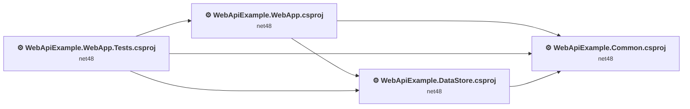
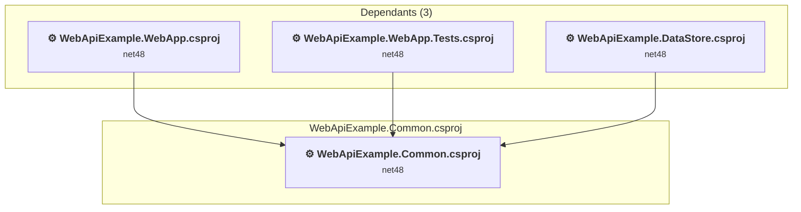
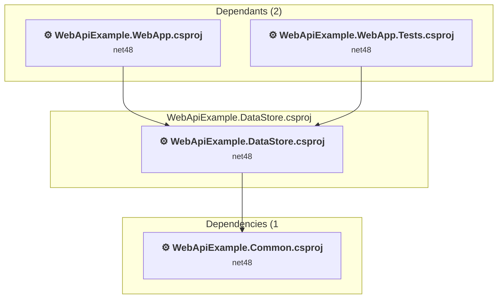
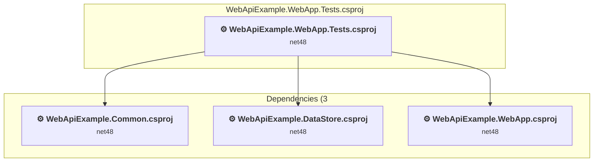
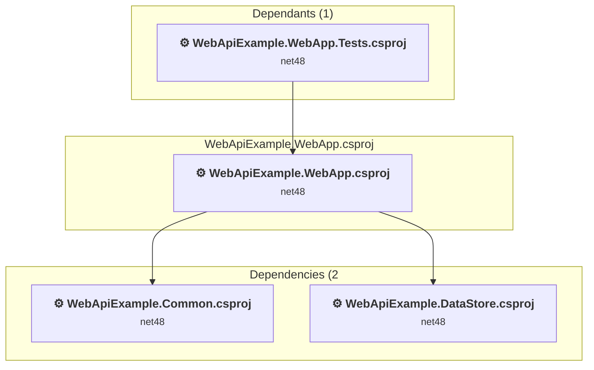

# Projects and dependencies analysis

This document provides a comprehensive overview of the projects and their dependencies in the context of upgrading to .NETCoreApp,Version=v10.0.

## Table of Contents

- [Executive Summary](#executive-Summary)
  - [Highlevel Metrics](#highlevel-metrics)
  - [Projects Compatibility](#projects-compatibility)
  - [Package Compatibility](#package-compatibility)
  - [API Compatibility](#api-compatibility)
- [Aggregate NuGet packages details](#aggregate-nuget-packages-details)
- [Top API Migration Challenges](#top-api-migration-challenges)
  - [Technologies and Features](#technologies-and-features)
  - [Most Frequent API Issues](#most-frequent-api-issues)
- [Projects Relationship Graph](#projects-relationship-graph)
- [Project Details](#project-details)

  - [WebApiExample.Common\WebApiExample.Common.csproj](#webapiexamplecommonwebapiexamplecommoncsproj)
  - [WebApiExample.DataStore\WebApiExample.DataStore.csproj](#webapiexampledatastorewebapiexampledatastorecsproj)
  - [WebApiExample.WebApp.Tests\WebApiExample.WebApp.Tests.csproj](#webapiexamplewebapptestswebapiexamplewebapptestscsproj)
  - [WebApiExample.WebApp\WebApiExample.WebApp.csproj](#webapiexamplewebappwebapiexamplewebappcsproj)

## Executive Summary

### Highlevel Metrics

| Metric | Count | Status |
| :--- | :---: | :--- |
| Total Projects | 4 | All require upgrade |
| Total NuGet Packages | 46 | 14 need upgrade |
| Total Code Files | 70 |  |
| Total Code Files with Incidents | 6 |  |
| Total Lines of Code | 4176 |  |
| Total Number of Issues | 45 |  |
| Estimated LOC to modify | 0+ | at least 0.0% of codebase |

### Projects Compatibility

| Project | Target Framework | Difficulty | Package Issues | API Issues | Est. LOC Impact | Description |
| :--- | :---: | :---: | :---: | :---: | :---: | :--- |
| [WebApiExample.Common\WebApiExample.Common.csproj](#webapiexamplecommonwebapiexamplecommoncsproj) | net48 | 🟢 Low | 0 | 0 |  | ClassicClassLibrary, Sdk Style = False |
| [WebApiExample.DataStore\WebApiExample.DataStore.csproj](#webapiexampledatastorewebapiexampledatastorecsproj) | net48 | 🟢 Low | 2 | 0 |  | ClassicClassLibrary, Sdk Style = False |
| [WebApiExample.WebApp.Tests\WebApiExample.WebApp.Tests.csproj](#webapiexamplewebapptestswebapiexamplewebapptestscsproj) | net48 | 🟢 Low | 14 | 0 |  | ClassicClassLibrary, Sdk Style = False |
| [WebApiExample.WebApp\WebApiExample.WebApp.csproj](#webapiexamplewebappwebapiexamplewebappcsproj) | net48 | 🔴 High | 19 | 0 |  | Wap, Sdk Style = False |

### Package Compatibility

| Status | Count | Percentage |
| :--- | :---: | :---: |
| ✅ Compatible | 32 | 69.6% |
| ⚠️ Incompatible | 8 | 17.4% |
| 🔄 Upgrade Recommended | 6 | 13.0% |
| ***Total NuGet Packages*** | ***46*** | ***100%*** |

### API Compatibility

| Category | Count | Impact |
| :--- | :---: | :--- |
| 🔴 Binary Incompatible | 0 | High - Require code changes |
| 🟡 Source Incompatible | 0 | Medium - Needs re-compilation and potential conflicting API error fixing |
| 🔵 Behavioral change | 0 | Low - Behavioral changes that may require testing at runtime |
| ✅ Compatible | 10 |  |
| ***Total APIs Analyzed*** | ***10*** |  |

## Aggregate NuGet packages details

| Package | Current Version | Suggested Version | Projects | Description |
| :--- | :---: | :---: | :--- | :--- |
| Antlr | 3.5.0.2 |  | [WebApiExample.WebApp.csproj](#webapiexamplewebappwebapiexamplewebappcsproj) | Needs to be replaced with Replace with new package Antlr4=4.6.6 |
| bootstrap | 3.3.7 | 5.3.8 | [WebApiExample.WebApp.csproj](#webapiexamplewebappwebapiexamplewebappcsproj) | NuGet package contains security vulnerability |
| Castle.Core | 4.4.0 |  | [WebApiExample.WebApp.Tests.csproj](#webapiexamplewebapptestswebapiexamplewebapptestscsproj) | ✅Compatible |
| DiffEngine | 6.4.9 |  | [WebApiExample.WebApp.Tests.csproj](#webapiexamplewebapptestswebapiexamplewebapptestscsproj) | ✅Compatible |
| EmptyFiles | 2.3.3 |  | [WebApiExample.WebApp.Tests.csproj](#webapiexamplewebapptestswebapiexamplewebapptestscsproj) | ✅Compatible |
| EntityFramework | 6.4.4 | 6.5.1 | [WebApiExample.DataStore.csproj](#webapiexampledatastorewebapiexampledatastorecsproj) [WebApiExample.WebApp.csproj](#webapiexamplewebappwebapiexamplewebappcsproj) | NuGet package upgrade is recommended |
| jQuery | 3.3.1 | 3.7.1 | [WebApiExample.WebApp.csproj](#webapiexamplewebappwebapiexamplewebappcsproj) | NuGet package contains security vulnerability |
| Microsoft.AspNet.Mvc | 5.2.4 |  | [WebApiExample.WebApp.csproj](#webapiexamplewebappwebapiexamplewebappcsproj) | NuGet package functionality is included with framework reference |
| Microsoft.AspNet.Mvc | 5.2.7 |  | [WebApiExample.WebApp.Tests.csproj](#webapiexamplewebapptestswebapiexamplewebapptestscsproj) | ⚠️NuGet package is incompatible |
| Microsoft.AspNet.Razor | 3.2.4 |  | [WebApiExample.WebApp.csproj](#webapiexamplewebappwebapiexamplewebappcsproj) | NuGet package functionality is included with framework reference |
| Microsoft.AspNet.Razor | 3.2.7 |  | [WebApiExample.WebApp.Tests.csproj](#webapiexamplewebapptestswebapiexamplewebapptestscsproj) | ⚠️NuGet package is incompatible |
| Microsoft.AspNet.Web.Optimization | 1.1.3 |  | [WebApiExample.WebApp.csproj](#webapiexamplewebappwebapiexamplewebappcsproj) | ⚠️NuGet package is incompatible |
| Microsoft.AspNet.WebApi | 5.2.4 |  | [WebApiExample.WebApp.csproj](#webapiexamplewebappwebapiexamplewebappcsproj) | NuGet package functionality is included with framework reference |
| Microsoft.AspNet.WebApi.Client | 5.2.7 |  | [WebApiExample.WebApp.csproj](#webapiexamplewebappwebapiexamplewebappcsproj) [WebApiExample.WebApp.Tests.csproj](#webapiexamplewebapptestswebapiexamplewebapptestscsproj) | ✅Compatible |
| Microsoft.AspNet.WebApi.Core | 5.2.7 |  | [WebApiExample.WebApp.csproj](#webapiexamplewebappwebapiexamplewebappcsproj) [WebApiExample.WebApp.Tests.csproj](#webapiexamplewebapptestswebapiexamplewebapptestscsproj) | ⚠️NuGet package is incompatible |
| Microsoft.AspNet.WebApi.HelpPage | 5.2.4 |  | [WebApiExample.WebApp.csproj](#webapiexamplewebappwebapiexamplewebappcsproj) | ✅Compatible |
| Microsoft.AspNet.WebApi.WebHost | 5.2.4 |  | [WebApiExample.WebApp.csproj](#webapiexamplewebappwebapiexamplewebappcsproj) | ⚠️NuGet package is incompatible |
| Microsoft.AspNet.WebApi.WebHost | 5.2.7 |  | [WebApiExample.WebApp.Tests.csproj](#webapiexamplewebapptestswebapiexamplewebapptestscsproj) | ⚠️NuGet package is incompatible |
| Microsoft.AspNet.WebPages | 3.2.4 |  | [WebApiExample.WebApp.csproj](#webapiexamplewebappwebapiexamplewebappcsproj) | NuGet package functionality is included with framework reference |
| Microsoft.AspNet.WebPages | 3.2.7 |  | [WebApiExample.WebApp.Tests.csproj](#webapiexamplewebapptestswebapiexamplewebapptestscsproj) | ⚠️NuGet package is incompatible |
| Microsoft.CodeDom.Providers.DotNetCompilerPlatform | 2.0.0 |  | [WebApiExample.WebApp.csproj](#webapiexamplewebappwebapiexamplewebappcsproj) | NuGet package functionality is included with framework reference |
| Microsoft.CSharp | 4.7.0 |  | [WebApiExample.WebApp.Tests.csproj](#webapiexamplewebapptestswebapiexamplewebapptestscsproj) | ✅Compatible |
| Microsoft.Web.Infrastructure | 1.0.0.0 |  | [WebApiExample.WebApp.csproj](#webapiexamplewebappwebapiexamplewebappcsproj) [WebApiExample.WebApp.Tests.csproj](#webapiexamplewebapptestswebapiexamplewebapptestscsproj) | NuGet package functionality is included with framework reference |
| Modernizr | 2.8.3 |  | [WebApiExample.WebApp.csproj](#webapiexamplewebappwebapiexamplewebappcsproj) | ✅Compatible |
| Moq | 4.16.1 |  | [WebApiExample.WebApp.Tests.csproj](#webapiexamplewebapptestswebapiexamplewebapptestscsproj) | ✅Compatible |
| Newtonsoft.Json | 11.0.1 | 13.0.4 | [WebApiExample.WebApp.csproj](#webapiexamplewebappwebapiexamplewebappcsproj) [WebApiExample.WebApp.Tests.csproj](#webapiexamplewebapptestswebapiexamplewebapptestscsproj) | NuGet package upgrade is recommended |
| Shouldly | 4.0.3 |  | [WebApiExample.WebApp.Tests.csproj](#webapiexamplewebapptestswebapiexamplewebapptestscsproj) | ✅Compatible |
| System.Buffers | 4.5.1 |  | [WebApiExample.WebApp.Tests.csproj](#webapiexamplewebapptestswebapiexamplewebapptestscsproj) | NuGet package functionality is included with framework reference |
| System.Memory | 4.5.4 |  | [WebApiExample.WebApp.Tests.csproj](#webapiexamplewebapptestswebapiexamplewebapptestscsproj) | NuGet package functionality is included with framework reference |
| System.Numerics.Vectors | 4.5.0 |  | [WebApiExample.WebApp.Tests.csproj](#webapiexamplewebapptestswebapiexamplewebapptestscsproj) | NuGet package functionality is included with framework reference |
| System.Runtime.CompilerServices.Unsafe | 4.5.2 | 6.1.2 | [WebApiExample.WebApp.csproj](#webapiexamplewebappwebapiexamplewebappcsproj) | NuGet package upgrade is recommended |
| System.Runtime.CompilerServices.Unsafe | 4.5.3 | 6.1.2 | [WebApiExample.WebApp.Tests.csproj](#webapiexamplewebapptestswebapiexamplewebapptestscsproj) | NuGet package upgrade is recommended |
| System.Runtime.InteropServices.RuntimeInformation | 4.3.0 |  | [WebApiExample.WebApp.Tests.csproj](#webapiexamplewebapptestswebapiexamplewebapptestscsproj) | NuGet package functionality is included with framework reference |
| System.Threading.Tasks.Extensions | 4.5.4 |  | [WebApiExample.WebApp.Tests.csproj](#webapiexamplewebapptestswebapiexamplewebapptestscsproj) | NuGet package functionality is included with framework reference |
| Unity | 5.11.10 |  | [WebApiExample.WebApp.csproj](#webapiexamplewebappwebapiexamplewebappcsproj) | ✅Compatible |
| Unity.WebAPI | 5.4.0 |  | [WebApiExample.WebApp.csproj](#webapiexamplewebappwebapiexamplewebappcsproj) | ⚠️NuGet package is incompatible |
| WebGrease | 1.6.0 |  | [WebApiExample.WebApp.csproj](#webapiexamplewebappwebapiexamplewebappcsproj) | ✅Compatible |
| xunit | 2.4.1 |  | [WebApiExample.WebApp.Tests.csproj](#webapiexamplewebapptestswebapiexamplewebapptestscsproj) | ✅Compatible |
| xunit.abstractions | 2.0.3 |  | [WebApiExample.WebApp.Tests.csproj](#webapiexamplewebapptestswebapiexamplewebapptestscsproj) | ✅Compatible |
| xunit.analyzers | 0.10.0 |  | [WebApiExample.WebApp.Tests.csproj](#webapiexamplewebapptestswebapiexamplewebapptestscsproj) | ✅Compatible |
| xunit.assert | 2.4.1 |  | [WebApiExample.WebApp.Tests.csproj](#webapiexamplewebapptestswebapiexamplewebapptestscsproj) | ✅Compatible |
| xunit.core | 2.4.1 |  | [WebApiExample.WebApp.Tests.csproj](#webapiexamplewebapptestswebapiexamplewebapptestscsproj) | ✅Compatible |
| xunit.extensibility.core | 2.4.1 |  | [WebApiExample.WebApp.Tests.csproj](#webapiexamplewebapptestswebapiexamplewebapptestscsproj) | ✅Compatible |
| xunit.extensibility.execution | 2.4.1 |  | [WebApiExample.WebApp.Tests.csproj](#webapiexamplewebapptestswebapiexamplewebapptestscsproj) | ✅Compatible |
| xunit.runner.console | 2.4.1 |  | [WebApiExample.WebApp.Tests.csproj](#webapiexamplewebapptestswebapiexamplewebapptestscsproj) | ✅Compatible |
| xunit.runner.visualstudio | 2.4.3 |  | [WebApiExample.WebApp.Tests.csproj](#webapiexamplewebapptestswebapiexamplewebapptestscsproj) | ✅Compatible |

## Top API Migration Challenges

### Technologies and Features

| Technology | Issues | Percentage | Migration Path |
| :--- | :---: | :---: | :--- |

### Most Frequent API Issues

| API | Count | Percentage | Category |
| :--- | :---: | :---: | :--- |

## Projects Relationship Graph

Legend:
📦 SDK-style project
⚙️ Classic project

## Project Details

### WebApiExample.Common\WebApiExample.Common.csproj

#### Project Info

- **Current Target Framework:** net48
- **Proposed Target Framework:** net10.0
- **SDK-style**: False
- **Project Kind:** ClassicClassLibrary
- **Dependencies**: 0
- **Dependants**: 3
- **Number of Files**: 3
- **Number of Files with Incidents**: 1
- **Lines of Code**: 61
- **Estimated LOC to modify**: 0+ (at least 0.0% of the project)

#### Dependency Graph

Legend:
📦 SDK-style project
⚙️ Classic project

### API Compatibility

| Category | Count | Impact |
| :--- | :---: | :--- |
| 🔴 Binary Incompatible | 0 | High - Require code changes |
| 🟡 Source Incompatible | 0 | Medium - Needs re-compilation and potential conflicting API error fixing |
| 🔵 Behavioral change | 0 | Low - Behavioral changes that may require testing at runtime |
| ✅ Compatible | 10 |  |
| ***Total APIs Analyzed*** | ***10*** |  |

### WebApiExample.DataStore\WebApiExample.DataStore.csproj

#### Project Info

- **Current Target Framework:** net48
- **Proposed Target Framework:** net10.0
- **SDK-style**: False
- **Project Kind:** ClassicClassLibrary
- **Dependencies**: 1
- **Dependants**: 2
- **Number of Files**: 3
- **Number of Files with Incidents**: 1
- **Lines of Code**: 110
- **Estimated LOC to modify**: 0+ (at least 0.0% of the project)

#### Dependency Graph

Legend:
📦 SDK-style project
⚙️ Classic project

### API Compatibility

| Category | Count | Impact |
| :--- | :---: | :--- |
| 🔴 Binary Incompatible | 0 | High - Require code changes |
| 🟡 Source Incompatible | 0 | Medium - Needs re-compilation and potential conflicting API error fixing |
| 🔵 Behavioral change | 0 | Low - Behavioral changes that may require testing at runtime |
| ✅ Compatible | 0 |  |
| ***Total APIs Analyzed*** | ***0*** |  |

### WebApiExample.WebApp.Tests\WebApiExample.WebApp.Tests.csproj

#### Project Info

- **Current Target Framework:** net48
- **Proposed Target Framework:** net10.0
- **SDK-style**: False
- **Project Kind:** ClassicClassLibrary
- **Dependencies**: 3
- **Dependants**: 0
- **Number of Files**: 4
- **Number of Files with Incidents**: 1
- **Lines of Code**: 393
- **Estimated LOC to modify**: 0+ (at least 0.0% of the project)

#### Dependency Graph

Legend:
📦 SDK-style project
⚙️ Classic project

### API Compatibility

| Category | Count | Impact |
| :--- | :---: | :--- |
| 🔴 Binary Incompatible | 0 | High - Require code changes |
| 🟡 Source Incompatible | 0 | Medium - Needs re-compilation and potential conflicting API error fixing |
| 🔵 Behavioral change | 0 | Low - Behavioral changes that may require testing at runtime |
| ✅ Compatible | 0 |  |
| ***Total APIs Analyzed*** | ***0*** |  |

### WebApiExample.WebApp\WebApiExample.WebApp.csproj

#### Project Info

- **Current Target Framework:** net48
- **Proposed Target Framework:** net10.0
- **SDK-style**: False
- **Project Kind:** Wap
- **Dependencies**: 2
- **Dependants**: 1
- **Number of Files**: 92
- **Number of Files with Incidents**: 3
- **Lines of Code**: 3612
- **Estimated LOC to modify**: 0+ (at least 0.0% of the project)

#### Dependency Graph

Legend:
📦 SDK-style project
⚙️ Classic project

### API Compatibility

| Category | Count | Impact |
| :--- | :---: | :--- |
| 🔴 Binary Incompatible | 0 | High - Require code changes |
| 🟡 Source Incompatible | 0 | Medium - Needs re-compilation and potential conflicting API error fixing |
| 🔵 Behavioral change | 0 | Low - Behavioral changes that may require testing at runtime |
| ✅ Compatible | 0 |  |
| ***Total APIs Analyzed*** | ***0*** |  |

