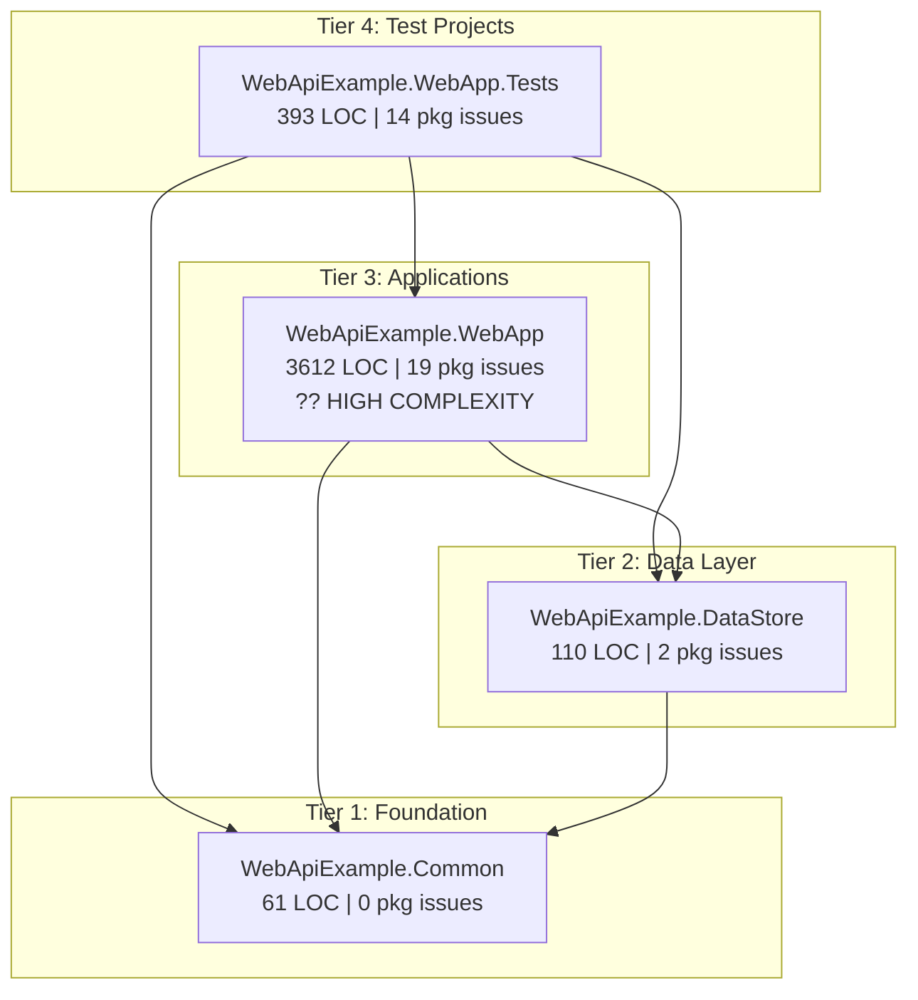

# .NET Framework 4.8 to .NET 10.0 Migration Plan

## Table of Contents

- [Executive Summary](#executive-summary)
- [Migration Strategy](#migration-strategy)
- [Detailed Dependency Analysis](#detailed-dependency-analysis)
- [Project-by-Project Plans](#project-by-project-plans)
  - [Tier 1: WebApiExample.Common](#tier-1-webapiexamplecommon)
  - [Tier 2: WebApiExample.DataStore](#tier-2-webapiexampledatastore)
  - [Tier 3: WebApiExample.WebApp](#tier-3-webapiexamplewebapp)
  - [Tier 4: WebApiExample.WebApp.Tests](#tier-4-webapiexamplewebapptests)
- [Package Update Reference](#package-update-reference)
- [Breaking Changes Catalog](#breaking-changes-catalog)
- [Risk Management](#risk-management)
- [Testing & Validation Strategy](#testing--validation-strategy)
- [Complexity & Effort Assessment](#complexity--effort-assessment)
- [Source Control Strategy](#source-control-strategy)
- [Success Criteria](#success-criteria)

---

## Executive Summary

### Scenario Overview

This plan guides the migration of a .NET Framework 4.8 ASP.NET Web API solution to .NET 10.0 (Long Term Support). The solution consists of 4 projects with a clear dependency hierarchy, totaling approximately 4,176 lines of code across 70 files.

### Scope

**Projects in Scope:**
- **WebApiExample.Common** - Shared utilities and models (61 LOC)
- **WebApiExample.DataStore** - Data access layer with Entity Framework (110 LOC)
- **WebApiExample.WebApp** - ASP.NET Web API application (3,612 LOC)
- **WebApiExample.WebApp.Tests** - Test project (393 LOC)

**Current State:** All projects target .NET Framework 4.8 using classic (non-SDK-style) project files

**Target State:** All projects migrated to .NET 10.0 with SDK-style project files

### Complexity Assessment

**Discovered Metrics:**
- Total Projects: 4
- Total NuGet Packages: 46 (14 require updates)
- Dependency Depth: 3 levels
- High-Risk Projects: 1 (WebApiExample.WebApp)
- Security Vulnerabilities: 3 packages (bootstrap, jQuery, Newtonsoft.Json)
- Incompatible Packages: 8
- Lines of Code: 4,176
- Files with Migration Issues: 6

**Complexity Classification: Medium**

**Justification:**
- ? Manageable project count (4 projects)
- ? Clear dependency hierarchy with no circular dependencies
- ? Good ratio of compatible packages (69.6%)
- ?? One high-complexity project (WebAPI application with ASP.NET-specific features)
- ?? Security vulnerabilities requiring immediate attention
- ?? ASP.NET-to-ASP.NET Core transition requires architectural changes

### Selected Strategy: Bottom-Up (Dependency-First)

**Strategy Rationale:**

This migration will follow a **Bottom-Up (Dependency-First)** approach, upgrading projects sequentially from leaf nodes (projects with no dependencies) upward through the dependency chain to the main application and tests. This strategy is optimal for this solution because:

1. **Clear Tier Structure**: The solution has a well-defined 4-tier dependency hierarchy with no circular references
2. **Risk Management**: Each tier builds on a stable, already-upgraded foundation, minimizing integration issues
3. **No Multi-Targeting Needed**: Dependencies are always on the same or newer framework than their consumers
4. **Progressive Validation**: Each tier can be thoroughly tested before proceeding to the next
5. **Isolated Complexity**: The high-complexity WebApp project is handled in Tier 3, after its dependencies are stable

**Alternative Considered:** All-at-once migration was considered but rejected due to:
- The presence of high-complexity ASP.NET features requiring careful attention
- Security vulnerabilities that benefit from incremental verification
- The desire to minimize risk and enable learning from early tiers

### Critical Issues

**Security Vulnerabilities (High Priority):**
- **bootstrap** 3.3.7 ? 5.3.8 (CVE-identified vulnerabilities)
- **jQuery** 3.3.1 ? 3.7.1 (CVE-identified vulnerabilities)  
- **Newtonsoft.Json** 11.0.1 ? 13.0.4 (CVE-identified vulnerabilities)

These will be addressed during the migration process within their respective tiers.

**Incompatible Packages:**
- Microsoft.AspNet.* packages (8 packages) - ASP.NET Framework-specific, require replacement or removal
- Unity.WebAPI - requires alternative or upgrade
- Microsoft.AspNet.Web.Optimization - bundling/minification needs modern approach

**ASP.NET-Specific Features:**
- System.Web.Optimization bundling/minification ? Replace with static references or modern bundler
- Global.asax.cs application initialization ? Convert to ASP.NET Core Program.cs/Startup.cs pattern

### Recommended Approach

**Incremental Migration (Bottom-Up Strategy)** - Migrate projects tier-by-tier in strict dependency order:

1. **Tier 1**: WebApiExample.Common (no dependencies) - Simplest migration, establishes pattern
2. **Tier 2**: WebApiExample.DataStore (depends on Tier 1) - Entity Framework considerations
3. **Tier 3**: WebApiExample.WebApp (depends on Tiers 1-2) - Highest complexity, ASP.NET Core conversion
4. **Tier 4**: WebApiExample.WebApp.Tests (depends on all) - Test framework adjustments

Each tier will be fully migrated, validated, and stabilized before proceeding to the next tier.

### Iteration Strategy

**Phase-Based Detail Generation** - This plan is being built through structured iterations:
- Foundation iterations: Dependency analysis, strategy definition, project stubs (completed)
- Detail iterations: One iteration per tier (4 iterations)
- Final iteration: Success criteria and source control strategy

**Expected Remaining Iterations:** 5 (4 tier details + 1 final)

## Migration Strategy

### Approach Selection: Bottom-Up (Dependency-First)

This migration will use an **incremental, bottom-up approach**, migrating projects tier-by-tier from the dependency tree's leaves (foundation projects) to its roots (applications and tests).

### Justification

**Why Bottom-Up for This Solution:**

1. **Clear Tier Structure** (4 tiers, no cycles)
   - Solution has identifiable dependency tiers with no circular references
   - Each tier has clear boundaries and dependencies
   - Single project per tier simplifies tier-level operations

2. **Risk-Averse Approach Preferred** (High-complexity project present)
   - WebApiExample.WebApp is flagged as ?? High complexity
   - ASP.NET-to-ASP.NET Core transition requires careful handling
   - Incremental approach allows learning from simpler tiers before tackling WebApp

3. **Security Vulnerabilities Benefit from Staged Verification**
   - 3 packages with CVE-identified vulnerabilities
   - Incremental approach enables thorough security validation at each tier
   - Reduces risk of introducing new vulnerabilities during bulk migration

4. **No Multi-Targeting Complexity**
   - Bottom-up ensures dependencies are always on same or newer framework than consumers
   - Avoids the complexity and performance overhead of multi-targeting
   - Simpler project files and build configurations

5. **Progressive Validation** (Medium-sized codebase)
   - 4,176 LOC across 4 projects is manageable for incremental migration
   - Each tier serves as a validation checkpoint
   - Issues can be isolated to specific tier rather than entire solution

**Alternative Rejected:** All-at-once migration
- **Why rejected**: Presence of high-complexity ASP.NET features, security vulnerabilities, and desire to maintain stability throughout migration make the higher risk of simultaneous migration unacceptable

### Dependency-Based Ordering Rationale

**Ordering Principle:** Projects must be migrated in strict tier order to maintain dependency compatibility.

**Tier Order Determination:**

1. **Tier 1: WebApiExample.Common** - Zero project dependencies (leaf node)
   - Foundation layer used by all other projects
   - Must migrate first to unblock all subsequent tiers
   - Simplest migration establishes patterns and confidence

2. **Tier 2: WebApiExample.DataStore** - Depends only on Tier 1
   - Data access layer with Entity Framework
   - Can begin after Tier 1 is stable
   - Validates EF 6.x compatibility with .NET 10.0

3. **Tier 3: WebApiExample.WebApp** - Depends on Tiers 1-2
   - Main application with ASP.NET-specific features
   - Highest complexity, benefits from stable dependencies
   - ASP.NET Core conversion is major architectural change

4. **Tier 4: WebApiExample.WebApp.Tests** - Depends on Tiers 1-3
   - Test project validating entire solution
   - Must be last to test against fully migrated application
   - Test framework adjustments based on WebApp migration

**Critical Rule:** No tier can begin migration until all lower-numbered tiers are **complete and validated**.

### Execution Decisions

#### Parallel vs Sequential Execution

**Sequential Execution Required** - Projects within each tier:
- Each tier contains **only 1 project**
- No parallel execution opportunities within tiers
- Simplifies coordination and reduces complexity

**Between-Tier Execution:**
- **Strictly sequential** - Cannot skip tiers or start next tier before current tier is validated
- Each tier has explicit completion criteria (see Testing Strategy)
- Tier completion includes: migration complete, builds successful, tests pass, stability verified

#### Phase Definitions

**Phase 1: Tier 1 Migration (Foundation)**
- **Scope**: WebApiExample.Common
- **Objective**: Migrate shared utilities to .NET 10.0, establish SDK-style pattern
- **Duration Estimate**: Low complexity (simple class library)
- **Success Criteria**: Builds on .NET 10.0, no breaking changes for consumers

**Phase 2: Tier 2 Migration (Data Layer)**
- **Scope**: WebApiExample.DataStore
- **Objective**: Migrate data access layer, validate Entity Framework 6.5.1 compatibility
- **Dependencies**: Phase 1 complete
- **Duration Estimate**: Low complexity (minimal package updates)
- **Success Criteria**: EF functionality works, data operations successful, no regressions

**Phase 3: Tier 3 Migration (Application)**
- **Scope**: WebApiExample.WebApp
- **Objective**: Convert ASP.NET Web API to ASP.NET Core, modernize architecture
- **Dependencies**: Phases 1-2 complete
- **Duration Estimate**: High complexity (architectural changes, 19 package issues)
- **Success Criteria**: ASP.NET Core app functional, API endpoints work, no security vulnerabilities

**Phase 4: Tier 4 Migration (Tests)**
- **Scope**: WebApiExample.WebApp.Tests
- **Objective**: Migrate test project, validate entire solution
- **Dependencies**: Phases 1-3 complete
- **Duration Estimate**: Medium complexity (test framework adjustments)
- **Success Criteria**: All tests pass, integration scenarios validated

### Bottom-Up Strategy Specific Considerations

#### Tier Completion Criteria

Each tier is considered complete when:
1. ? Project file converted to SDK-style
2. ? Target framework updated to net10.0
3. ? All package updates applied
4. ? Project builds without errors or warnings
5. ? Unit tests pass (if project has tests)
6. ? Integration with lower tiers validated
7. ? Higher tiers (still on net48) still function correctly (no breaking changes introduced)

#### Between-Tier Validation

After completing each tier, verify:
- **Build Verification**: Tier project builds successfully on .NET 10.0
- **No Regressions**: Lower tiers (already migrated) still build and test successfully
- **Consumer Compatibility**: Higher tiers (still on .NET Framework 4.8) can still reference and use the upgraded tier
  - This validates we haven't introduced breaking API changes
  - May require conditional testing or temporary compatibility measures
- **Security Scan**: No new vulnerabilities introduced

**Important**: Higher tiers remaining on .NET Framework 4.8 must still be able to consume upgraded libraries until their turn to migrate. This is feasible because .NET Standard 2.0 compatibility allows .NET Framework 4.8 to reference .NET Core/.NET 10.0 libraries targeting netstandard2.0 or compatible frameworks.

#### Incremental Benefits

What gets unlocked after each tier:

- **After Tier 1**: 
  - Shared models and utilities on .NET 10.0
  - SDK-style project pattern established
  - Foundation for all other projects stable

- **After Tier 2**: 
  - Data layer on .NET 10.0
  - Entity Framework 6.5.1 benefits available
  - Data access patterns validated

- **After Tier 3**: 
  - Main application on ASP.NET Core / .NET 10.0
  - Security vulnerabilities resolved
  - Modern web framework benefits available
  - Incompatible packages replaced

- **After Tier 4**: 
  - Entire solution on .NET 10.0
  - Full test coverage on modern framework
  - Migration complete and validated

### Risk Management Through Strategy

The bottom-up strategy inherently mitigates risks:

1. **Lower Risk Per Change**: Each tier is smaller scope than whole solution
2. **Earlier Issue Detection**: Problems found in simple tiers before complex ones
3. **Stable Foundation**: Each tier builds on verified, stable dependencies
4. **Easier Debugging**: Issues isolated to current tier, not intertwined
5. **Learning Curve**: Lessons from Tier 1 apply to subsequent tiers
6. **Rollback Capability**: Can roll back single tier without affecting completed tiers

## Detailed Dependency Analysis

### Dependency Graph Structure

The solution exhibits a clean, hierarchical dependency structure with 4 distinct tiers. No circular dependencies were detected, making this ideal for bottom-up migration.

**Tier Visualization:**

```
Tier 4: [WebApiExample.WebApp.Tests]
         ? (depends on all below)
Tier 3: [WebApiExample.WebApp]
         ? (depends on Tiers 1-2)
Tier 2: [WebApiExample.DataStore]
         ? (depends on Tier 1)
Tier 1: [WebApiExample.Common]
         (no project dependencies)
```

**Detailed Dependency Map:**



### Project Groupings by Migration Phase

#### Tier 1 (Leaf Nodes - No Project Dependencies)
- **WebApiExample.Common** (WebApiExample.Common\WebApiExample.Common.csproj)
  - **Dependencies**: None
  - **Dependants**: 3 projects (all other projects depend on this)
  - **Why in Tier 1**: No project dependencies, serves as foundation for all other projects
  - **Migration Priority**: First (must complete before any other project)

#### Tier 2 (Depends Only on Tier 1)
- **WebApiExample.DataStore** (WebApiExample.DataStore\WebApiExample.DataStore.csproj)
  - **Dependencies**: WebApiExample.Common (Tier 1)
  - **Dependants**: 2 projects (WebApp, Tests)
  - **Why in Tier 2**: Only depends on Tier 1, provides data access to application layer
  - **Migration Priority**: Second (can start after Tier 1 complete)

#### Tier 3 (Depends on Tiers 1-2)
- **WebApiExample.WebApp** (WebApiExample.WebApp\WebApiExample.WebApp.csproj)
  - **Dependencies**: WebApiExample.Common (Tier 1), WebApiExample.DataStore (Tier 2)
  - **Dependants**: 1 project (Tests)
  - **Why in Tier 3**: Main application, depends on both foundation and data layers
  - **Migration Priority**: Third (requires Tiers 1-2 complete, highest complexity)

#### Tier 4 (Depends on All Previous Tiers)
- **WebApiExample.WebApp.Tests** (WebApiExample.WebApp.Tests\WebApiExample.WebApp.Tests.csproj)
  - **Dependencies**: WebApiExample.Common (Tier 1), WebApiExample.DataStore (Tier 2), WebApiExample.WebApp (Tier 3)
  - **Dependants**: None (test project)
  - **Why in Tier 4**: Tests the entire solution, depends on all other projects
  - **Migration Priority**: Last (requires all tiers complete)

### Critical Path Identification

**Primary Critical Path:**
```
Common (Tier 1) ? DataStore (Tier 2) ? WebApp (Tier 3) ? Tests (Tier 4)
```

This is the **only path** through the dependency graph, making the critical path straightforward:

1. **Tier 1 must complete first** - Common is the foundation for all other projects
2. **Tier 2 depends on Tier 1** - DataStore cannot be migrated until Common is stable on .NET 10.0
3. **Tier 3 depends on Tiers 1-2** - WebApp requires both dependencies upgraded
4. **Tier 4 depends on all** - Tests validate the entire upgraded solution

**Blocking Relationships:**
- **Common blocks**: DataStore, WebApp, Tests
- **DataStore blocks**: WebApp, Tests
- **WebApp blocks**: Tests

**No Parallel Opportunities**: Each tier contains a single project, so no parallel migration within tiers is possible. However, this simplifies coordination and reduces risk.

### Tier Complexity Assessment

| Tier | Projects | Complexity | Rationale |
|------|----------|------------|-----------|
| **Tier 1** | 1 | ?? **Low** | Simple class library, no packages, minimal LOC (61), no external dependencies |
| **Tier 2** | 1 | ?? **Low** | Data access layer, 2 package updates (EntityFramework), straightforward migration |
| **Tier 3** | 1 | ?? **High** | ASP.NET Web API app, 19 package issues, ASP.NET-specific features, 3612 LOC, architectural changes required |
| **Tier 4** | 1 | ?? **Medium** | Test project, 14 package issues, depends on migrated WebApp functionality |

### Circular Dependency Analysis

? **No circular dependencies detected** in the solution.

All dependency relationships are unidirectional and properly layered, which is ideal for bottom-up migration. Each project can be cleanly migrated once its dependencies are complete.

## Project-by-Project Plans

### Tier 1: WebApiExample.Common

#### Current State
- **Project Path**: WebApiExample.Common\WebApiExample.Common.csproj
- **Current Framework**: net48
- **SDK-Style**: No (Classic project format)
- **Project Type**: ClassicClassLibrary
- **Dependencies**: 0 project references
- **Dependants**: 3 projects (WebApiExample.DataStore, WebApiExample.WebApp, WebApiExample.WebApp.Tests)
- **NuGet Packages**: 0
- **Files**: 3
- **Lines of Code**: 61
- **Package Issues**: 0
- **Risk Level**: ?? Low

#### Target State
- **Target Framework**: net10.0
- **SDK-Style**: Yes
- **Package Updates**: None required

#### Migration Steps

##### 1. Prerequisites
- ? Tier 1 has no dependencies, can start immediately
- ? Ensure .NET 10.0 SDK installed on development machine
- ? Verify current branch is `upgrade-to-NET10-01`
- ? Create backup/commit current state before migration

**Validation**: Run `dotnet --version` to confirm .NET 10.0 SDK available

##### 2. Convert to SDK-Style Project

**Action**: Convert classic project file to SDK-style format

**Methods**:
- **Option 1 (Recommended)**: Use try-convert tool
  ```bash
  dotnet tool install -g try-convert
  try-convert WebApiExample.Common\WebApiExample.Common.csproj
  ```
- **Option 2**: Manual conversion - replace entire .csproj content with SDK-style format

**Expected SDK-Style Project File** (minimal):
```xml
<Project Sdk="Microsoft.NET.Sdk">
  <PropertyGroup>
    <TargetFramework>net10.0</TargetFramework>
    <RootNamespace>WebApiExample.Common</RootNamespace>
    <AssemblyName>WebApiExample.Common</AssemblyName>
  </PropertyGroup>
</Project>
```

**Verification**:
- Check all source files included (SDK-style includes files by convention)
- Verify no `packages.config` file (no packages to migrate)
- Ensure AssemblyInfo.cs properties moved to .csproj if needed

##### 3. Update Target Framework

**Action**: Change `<TargetFramework>` from net48 to net10.0

**Changes**:
```xml
<TargetFramework>net10.0</TargetFramework>
```

**Validation**: Project file contains correct target framework

##### 4. Package Updates

**No package updates required** - This project has no NuGet dependencies.

##### 5. Expected Breaking Changes

**None Expected** - This is a simple class library with no external dependencies.

**Potential Issues**:
- **API Changes**: Unlikely, but verify any .NET Framework-specific APIs if used
- **Namespace Changes**: Check for any System.* namespace changes
- **Behavioral Changes**: Minimal risk given small codebase (61 LOC)

**If Breaking Changes Found**:
- Check compiler errors for obsolete APIs
- Use Visual Studio's "Quick Actions" for automatic fixes
- Consult .NET 10.0 breaking changes documentation

##### 6. Code Modifications

**Expected Modifications**: Minimal to none

**Areas to Review**:
1. **AssemblyInfo.cs**: May need to remove duplicated attributes now in .csproj
   - Remove: `AssemblyVersion`, `AssemblyFileVersion`, `AssemblyTitle`, etc. if duplicated
   - Keep: Custom attributes not supported in .csproj

2. **Using Directives**: No changes expected (simple models/utilities)

3. **API Usage**: Review any framework-specific APIs
   - Check for `System.Web.*` references (none expected in Common project)
   - Verify LINQ, collections, and basic types work identically

**Configuration Changes**: None (no app.config expected in class library)

##### 7. Testing Strategy

**Build Verification**:
```bash
cd WebApiExample.Common
dotnet build
```
- ? Builds without errors
- ? Builds without warnings
- ? Output assemblies created successfully

**Consumer Compatibility Verification**:
- **Important**: Verify higher tiers (still on net48) can still reference this library
- Build WebApiExample.DataStore (Tier 2, still net48) - should still build
- Build WebApiExample.WebApp (Tier 3, still net48) - should still build
- Build WebApiExample.WebApp.Tests (Tier 4, still net48) - should still build

**Why This Works**: .NET 10.0 libraries can be referenced by .NET Framework 4.8 projects if they target netstandard2.0 or compatible frameworks, or through careful compatibility management.

**Unit Tests**: 
- No dedicated unit test project for Common (tests likely in WebApp.Tests)
- Will be validated when Tier 4 (Tests) is migrated

**Smoke Tests**:
- Verify public API surface unchanged
- Check any utility methods still function correctly
- Validate models serialize/deserialize correctly

##### 8. Validation Checklist

- [ ] Project file converted to SDK-style
- [ ] Target framework is net10.0
- [ ] Project builds successfully (`dotnet build`)
- [ ] No build errors
- [ ] No build warnings
- [ ] All source files included in build
- [ ] AssemblyInfo.cs conflicts resolved (if any)
- [ ] Higher tier projects (still net48) can still build with this change
- [ ] No breaking API changes introduced
- [ ] Changes committed to `upgrade-to-NET10-01` branch

**Completion Criteria**:
? All checklist items complete
? Tier 1 project stable on .NET 10.0
? No regressions in higher tiers
? Ready to proceed to Tier 2

#### Tier 1 Specific Risks & Mitigation

| Risk | Likelihood | Impact | Mitigation |
|------|------------|--------|------------|
| SDK conversion excludes files | Low | Medium | Verify all .cs files in project after conversion; check for Content/Embedded Resource files |
| AssemblyInfo conflicts | Low | Low | Remove duplicate attributes from AssemblyInfo.cs |
| Higher tiers can't reference upgraded library | Low | High | Test consumer builds after Tier 1; consider multi-targeting (netstandard2.0;net10.0) if issues arise |

**Rollback Plan**: 
- Revert changes from git: `git checkout WebApiExample.Common\WebApiExample.Common.csproj`
- Restore from backup if needed

### Tier 2: WebApiExample.DataStore

#### Current State
- **Project Path**: WebApiExample.DataStore\WebApiExample.DataStore.csproj
- **Current Framework**: net48
- **SDK-Style**: No (Classic project format)
- **Project Type**: ClassicClassLibrary
- **Dependencies**: 1 project reference (WebApiExample.Common)
- **Dependants**: 2 projects (WebApiExample.WebApp, WebApiExample.WebApp.Tests)
- **NuGet Packages**: 1 (EntityFramework 6.4.4)
- **Files**: 3
- **Lines of Code**: 110
- **Package Issues**: 2 (EntityFramework upgrade recommended)
- **Risk Level**: ?? Low

#### Target State
- **Target Framework**: net10.0
- **SDK-Style**: Yes
- **Package Updates**: 1 (EntityFramework 6.4.4 ? 6.5.1)

#### Migration Steps

##### 1. Prerequisites

**Dependencies**:
- ? **Tier 1 must be complete** - WebApiExample.Common must be migrated to net10.0 and stable
- ? Verify Tier 1 validation checklist complete
- ? Ensure no regressions in Tier 1

**Tooling**:
- ? .NET 10.0 SDK installed
- ? Entity Framework 6.5.1 compatible with .NET 10.0 verified

**Validation**: 
- Confirm WebApiExample.Common builds on net10.0
- Check current branch is `upgrade-to-NET10-01`
- Commit/backup current state

##### 2. Convert to SDK-Style Project

**Action**: Convert classic project file to SDK-style format

**Method**:
```bash
try-convert WebApiExample.DataStore\WebApiExample.DataStore.csproj
```

**Expected SDK-Style Project File**:
```xml
<Project Sdk="Microsoft.NET.Sdk">
  <PropertyGroup>
    <TargetFramework>net10.0</TargetFramework>
    <RootNamespace>WebApiExample.DataStore</RootNamespace>
    <AssemblyName>WebApiExample.DataStore</AssemblyName>
  </PropertyGroup>

  <ItemGroup>
    <PackageReference Include="EntityFramework" Version="6.5.1" />
  </ItemGroup>

  <ItemGroup>
    <ProjectReference Include="..\WebApiExample.Common\WebApiExample.Common.csproj" />
  </ItemGroup>
</Project>
```

**Verification**:
- All source files included
- Project reference to WebApiExample.Common preserved
- No `packages.config` file remains (migrated to PackageReference)
- App.config or Web.config preserved if exists (EF connection strings may be here)

##### 3. Update Target Framework

**Action**: Change `<TargetFramework>` to net10.0

**Changes**:
```xml
<TargetFramework>net10.0</TargetFramework>
```

##### 4. Package Updates

**Tier 2 Package Updates** (1 package in this tier):

| Package | Current Version | Target Version | Reason | Scope |
|---------|-----------------|----------------|--------|-------|
| **EntityFramework** | 6.4.4 | 6.5.1 | Upgrade recommended; improved .NET compatibility | WebApiExample.DataStore |

**Update Method**:

**Option 1 - Edit .csproj directly**:
```xml
<PackageReference Include="EntityFramework" Version="6.5.1" />
```

**Option 2 - Use dotnet CLI**:
```bash
cd WebApiExample.DataStore
dotnet add package EntityFramework --version 6.5.1
```

**Verification**:
- Run `dotnet restore` successfully
- Check no package conflicts
- Verify EF 6.5.1 installed

##### 5. Expected Breaking Changes

**Entity Framework 6.x to 6.5.1 on .NET 10.0**:

**Minimal Breaking Changes Expected**:
- EF 6.5.1 is designed for .NET Core/.NET compatibility
- Most EF 6.x code should work unchanged
- Database providers (SQL Server, etc.) should work

**Potential Issues**:

1. **Configuration Changes**:
   - App.config/Web.config EF configuration may need updates
   - Code-based configuration preferred on .NET Core/.NET
   - Check `DbConfiguration` classes

2. **Connection Strings**:
   - May need to move from App.config to code-based configuration
   - Environment variables or appsettings.json for connection strings

3. **Database Migrations**:
   - Existing migrations should work
   - May need to regenerate if issues arise
   - Migration commands: `Add-Migration`, `Update-Database` still supported

4. **Provider-Specific Issues**:
   - Verify SQL Server provider compatible
   - Check for Oracle, MySQL, PostgreSQL provider updates if used

**API Compatibility**:
- `DbContext`, `DbSet<T>`, LINQ queries - no changes expected
- Lazy loading, change tracking - behavior should be identical
- Migrations API - compatible

##### 6. Code Modifications

**Expected Modifications**: Minimal

**Areas to Review**:

1. **DbContext Classes**:
   - No changes expected to DbContext implementations
   - Verify `OnModelCreating` methods work
   - Check Fluent API configurations

2. **Connection String Management**:
   - **If in App.config**: May need to migrate to code-based configuration
   - **Alternative**: Keep App.config for now, migrate in Tier 3 (WebApp) when app configuration is addressed

3. **EF Migrations**:
   - **Verify existing migrations** in Migrations folder
   - **Test migration commands**:
     ```bash
     dotnet ef migrations list
     ```
   - **Regenerate if needed**: If migration issues, consider regenerating

4. **Database Initialization**:
   - Check for `Database.SetInitializer` calls
   - Verify seed data methods work

**Configuration File Changes**:
- **App.config/Web.config**: May exist for connection strings
- **Keep for now** - Detailed configuration migration in Tier 3
- **Ensure EF sections present**:
  ```xml
  <configSections>
    <section name="entityFramework" type="System.Data.Entity.Internal.ConfigFile.EntityFrameworkSection, EntityFramework" />
  </configSections>
  <entityFramework>
    <defaultConnectionFactory type="System.Data.Entity.Infrastructure.SqlConnectionFactory, EntityFramework" />
  </entityFramework>
  ```

##### 7. Testing Strategy

**Build Verification**:
```bash
cd WebApiExample.DataStore
dotnet build
```
- ? Builds without errors
- ? Builds without warnings
- ? EntityFramework 6.5.1 restored successfully

**Integration with Tier 1**:
- ? References WebApiExample.Common (net10.0) successfully
- ? No dependency conflicts

**Data Access Testing**:

**Unit Tests** (if exist):
- Run any DbContext unit tests
- Verify LINQ queries return expected results
- Check repository pattern methods work

**Database Connection Test**:
- **Test connection string works**:
  ```csharp
  using (var context = new YourDbContext())
  {
      bool canConnect = context.Database.Exists();
      Console.WriteLine($"Can connect: {canConnect}");
  }
  ```
- Verify no connection errors
- Check database provider loaded correctly

**Migration Verification**:
- Run `dotnet ef migrations list` - should list existing migrations
- Optionally run `Update-Database` in test environment to ensure migrations work

**Consumer Compatibility**:
- Build WebApiExample.WebApp (Tier 3, still net48) - should still build
- Build WebApiExample.WebApp.Tests (Tier 4, still net48) - should still build

##### 8. Validation Checklist

- [ ] **Prerequisite**: Tier 1 (Common) complete and stable
- [ ] Project file converted to SDK-style
- [ ] Target framework is net10.0
- [ ] EntityFramework updated to 6.5.1
- [ ] Project reference to WebApiExample.Common works
- [ ] Project builds successfully (`dotnet build`)
- [ ] No build errors
- [ ] No build warnings
- [ ] Package restore successful (`dotnet restore`)
- [ ] No package dependency conflicts
- [ ] Database connection successful (if database available)
- [ ] EF migrations listed successfully
- [ ] Data access operations work (basic CRUD tests)
- [ ] Higher tier projects (still net48) can still build
- [ ] No breaking changes to public API
- [ ] Changes committed to `upgrade-to-NET10-01` branch

**Completion Criteria**:
? All checklist items complete
? Tier 2 project stable on .NET 10.0
? Entity Framework 6.5.1 working correctly
? No regressions in Tier 1 or higher tiers
? Ready to proceed to Tier 3

#### Tier 2 Specific Risks & Mitigation

| Risk | Likelihood | Impact | Mitigation |
|------|------------|--------|------------|
| EF 6.5.1 incompatible with .NET 10.0 | Low | High | Verify EF 6.5.1 + .NET 10.0 compatibility in test environment first; fallback to EF 6.4.4 if critical issues; consider EF Core as alternative |
| Connection string configuration issues | Medium | Medium | Test database connection early; migrate connection strings to code-based config if App.config problematic |
| Migration regeneration required | Low | Medium | Have database backup; test migrations in dev environment before production; document migration commands |
| SQL provider compatibility | Low | Medium | Verify System.Data.SqlClient or Microsoft.Data.SqlClient works; update provider if needed |

**Rollback Plan**:
- Revert project file changes from git
- Restore EntityFramework 6.4.4 if 6.5.1 incompatible
- Roll back Tier 2, keep on net48 until issues resolved

### Tier 3: WebApiExample.WebApp

#### Current State
- **Project Path**: WebApiExample.WebApp\WebApiExample.WebApp.csproj
- **Current Framework**: net48
- **SDK-Style**: No (Classic project format)
- **Project Type**: Wap (Web Application Project)
- **Dependencies**: 2 project references (WebApiExample.Common, WebApiExample.DataStore)
- **Dependants**: 1 project (WebApiExample.WebApp.Tests)
- **NuGet Packages**: 18 packages
- **Files**: 92
- **Lines of Code**: 3,612
- **Package Issues**: 19 (8 incompatible, 6 security/upgrade, 5 included in framework)
- **Risk Level**: ?? High

#### Target State
- **Target Framework**: net10.0
- **SDK-Style**: Yes
- **Package Updates**: 19 total updates/removals/replacements

#### Migration Steps

##### 1. Prerequisites

**Dependencies**:
- ? **Tier 1 complete** - WebApiExample.Common migrated to net10.0
- ? **Tier 2 complete** - WebApiExample.DataStore migrated to net10.0, EF working
- ? Both Tier 1-2 validation checklists complete
- ? No regressions in Tiers 1-2

**Tooling**:
- ? .NET 10.0 SDK with ASP.NET Core runtime installed
- ? Visual Studio or VS Code with C# extension
- ? try-convert tool for SDK conversion

**Pre-Migration Analysis**:
- ? Review Global.asax.cs for application startup code
- ? Identify bundling/minification usage in views
- ? Document current API endpoints and routes
- ? List all dependency injection registrations (Unity)
- ? Backup Web.config (will be replaced with appsettings.json)

**Validation**:
- Test current application works on .NET Framework 4.8
- Document baseline functionality
- Commit current state to git

##### 2. Convert to SDK-Style Project

**Action**: Convert Web Application Project to SDK-style ASP.NET Core project

**Challenge**: Web Application Projects (Wap) are complex - try-convert may need manual assistance

**Method**:

**Step 1 - Run try-convert**:
```bash
try-convert WebApiExample.WebApp\WebApiExample.WebApp.csproj --force-web-conversion
```

**Step 2 - Manual SDK-Style Structure**:

Create new SDK-style .csproj:
```xml
<Project Sdk="Microsoft.NET.Sdk.Web">
  <PropertyGroup>
    <TargetFramework>net10.0</TargetFramework>
    <RootNamespace>WebApiExample.WebApp</RootNamespace>
    <AssemblyName>WebApiExample.WebApp</AssemblyName>
    <Nullable>enable</Nullable>
    <ImplicitUsings>enable</ImplicitUsings>
  </PropertyGroup>

  <ItemGroup>
    <!-- Package references to be filled in step 4 -->
  </ItemGroup>

  <ItemGroup>
    <ProjectReference Include="..\WebApiExample.Common\WebApiExample.Common.csproj" />
    <ProjectReference Include="..\WebApiExample.DataStore\WebApiExample.DataStore.csproj" />
  </ItemGroup>
</Project>
```

**Important**: Use `Microsoft.NET.Sdk.Web` SDK for ASP.NET Core projects

**Verification**:
- All .cs files included by convention
- Project references preserved
- Remove packages.config (migrate to PackageReference)
- Content files (CSS, JS, images) included in wwwroot folder

##### 3. Update Target Framework

**Action**: Set target framework to net10.0

```xml
<TargetFramework>net10.0</TargetFramework>
```

##### 4. Package Updates

**Tier 3 Package Updates** (19 packages total):

This tier has the most complex package migration due to ASP.NET Framework ? ASP.NET Core transition.

**Security Vulnerabilities (CRITICAL - Address First)**:

| Package | Current | Target | CVE/Reason | Action |
|---------|---------|--------|------------|--------|
| **bootstrap** | 3.3.7 | 5.3.8 | Security vulnerabilities | Upgrade to 5.3.8 (breaking UI changes possible) |
| **jQuery** | 3.3.1 | 3.7.1 | Security vulnerabilities | Upgrade to 3.7.1 (minimal breaking changes) |
| **Newtonsoft.Json** | 11.0.1 | 13.0.4 | Security vulnerabilities | Upgrade to 13.0.4; consider System.Text.Json migration |

**Packages to REMOVE (Incompatible - Now in Framework)**:

| Package | Current | Reason | Replacement |
|---------|---------|--------|-------------|
| **Microsoft.AspNet.Mvc** | 5.2.4 | Incompatible; functionality in ASP.NET Core | Built into framework |
| **Microsoft.AspNet.Razor** | 3.2.4 | Incompatible; functionality in ASP.NET Core | Built into framework |
| **Microsoft.AspNet.WebApi** | 5.2.4 | Incompatible; functionality in ASP.NET Core | Built into framework |
| **Microsoft.AspNet.WebApi.Core** | 5.2.7 | Incompatible; Web API in ASP.NET Core | Built into framework |
| **Microsoft.AspNet.WebApi.WebHost** | 5.2.4 | Incompatible; hosting model changed | Built into framework |
| **Microsoft.AspNet.WebPages** | 3.2.4 | Incompatible; Razor Pages in ASP.NET Core | Built into framework |
| **Microsoft.CodeDom.Providers.DotNetCompilerPlatform** | 2.0.0 | Incompatible; Roslyn built into .NET | Built into framework |
| **Microsoft.Web.Infrastructure** | 1.0.0.0 | Incompatible; not needed in ASP.NET Core | Built into framework |

**Packages to REMOVE or REPLACE (Incompatible)**:

| Package | Current | Reason | Replacement |
|---------|---------|--------|-------------|
| **Microsoft.AspNet.Web.Optimization** | 1.1.3 | Incompatible; bundling/minification model changed | Remove; use static references or WebOptimizer |
| **Unity.WebAPI** | 5.4.0 | Incompatible; ASP.NET Core has built-in DI | Remove; use built-in DI |
| **Antlr** | 3.5.0.2 | Deprecated | Replace with Antlr4 v4.6.6 if still needed (check if actually used) |

**Packages to UPGRADE**:

| Package | Current | Target | Reason |
|---------|---------|--------|--------|
| **EntityFramework** | 6.4.4 | 6.5.1 | Upgrade recommended (inherited from DataStore) |
| **System.Runtime.CompilerServices.Unsafe** | 4.5.2 | 6.1.2 | Upgrade recommended |

**Packages COMPATIBLE (Keep)**:

| Package | Current | Status |
|---------|---------|--------|
| **Microsoft.AspNet.WebApi.Client** | 5.2.7 | ? Compatible with ASP.NET Core |
| **Microsoft.AspNet.WebApi.HelpPage** | 5.2.4 | ? Compatible (API documentation) |
| **Modernizr** | 2.8.3 | ? Compatible (client-side library) |
| **Unity** | 5.11.10 | ? Compatible (but prefer built-in DI) |
| **WebGrease** | 1.6.0 | ? Compatible (but may not need) |

**New Packages REQUIRED for ASP.NET Core**:

```xml
<ItemGroup>
  <!-- ASP.NET Core is built into the framework when using Microsoft.NET.Sdk.Web -->
  <!-- May need to explicitly add: -->
  <PackageReference Include="Microsoft.AspNetCore.Mvc.NewtonsoftJson" Version="10.0.0" />
  
  <!-- If using Entity Framework with ASP.NET Core DI -->
  <PackageReference Include="EntityFramework" Version="6.5.1" />
  
  <!-- Security updates -->
  <PackageReference Include="Newtonsoft.Json" Version="13.0.4" />
</ItemGroup>
```

**Package Update Commands**:
```bash
cd WebApiExample.WebApp

# Remove incompatible packages
dotnet remove package Microsoft.AspNet.Mvc
dotnet remove package Microsoft.AspNet.Razor
dotnet remove package Microsoft.AspNet.WebApi
dotnet remove package Microsoft.AspNet.WebApi.Core
dotnet remove package Microsoft.AspNet.WebApi.WebHost
dotnet remove package Microsoft.AspNet.WebPages
dotnet remove package Microsoft.CodeDom.Providers.DotNetCompilerPlatform
dotnet remove package Microsoft.Web.Infrastructure
dotnet remove package Microsoft.AspNet.Web.Optimization
dotnet remove package Unity.WebAPI

# Add/Update required packages
dotnet add package Newtonsoft.Json --version 13.0.4
dotnet add package Microsoft.AspNetCore.Mvc.NewtonsoftJson --version 10.0.0
dotnet add package EntityFramework --version 6.5.1

# Update JavaScript packages (manual update in project or via npm/package manager)
# - bootstrap: 3.3.7 ? 5.3.8 (update references in HTML/cshtml files)
# - jQuery: 3.3.1 ? 3.7.1 (update references in HTML/cshtml files)
```

##### 5. Expected Breaking Changes

**ASP.NET Framework ? ASP.NET Core Breaking Changes** (Major):

**5.1 Application Startup (Global.asax ? Program.cs)**

**Old (Global.asax.cs)**:
```csharp
public class WebApiApplication : System.Web.HttpApplication
{
    protected void Application_Start()
    {
        GlobalConfiguration.Configure(WebApiConfig.Register);
        // Other initialization
    }
}
```

**New (Program.cs)** - Create new file:
```csharp
var builder = WebApplication.CreateBuilder(args);

// Add services to the container
builder.Services.AddControllers()
    .AddNewtonsoftJson(); // If using Newtonsoft.Json

// Add Entity Framework DbContext
// builder.Services.AddDbContext<YourDbContext>(...);

// Add other services (was in Unity configuration)
// builder.Services.AddScoped<IService, ServiceImpl>();

var app = builder.Build();

// Configure middleware pipeline
if (app.Environment.IsDevelopment())
{
    app.UseDeveloperExceptionPage();
}

app.UseHttpsRedirection();
app.UseStaticFiles(); // For wwwroot content
app.UseRouting();
app.UseAuthorization();
app.MapControllers();

app.Run();
```

**Action**: 
- Create `Program.cs` in project root
- Migrate Application_Start logic to Program.cs
- Remove Global.asax and Global.asax.cs

**5.2 Web API Configuration (WebApiConfig.cs)**

**Old (App_Start\WebApiConfig.cs)**:
```csharp
public static class WebApiConfig
{
    public static void Register(HttpConfiguration config)
    {
        config.MapHttpAttributeRoutes();
        config.Routes.MapHttpRoute(...);
    }
}
```

**New (Integrated into Program.cs)**:
- Attribute routing is default in ASP.NET Core
- Use `[ApiController]` and `[Route]` attributes on controllers
- Configure in Program.cs with `app.MapControllers()`

**Action**:
- Remove App_Start folder
- Apply routing attributes to controllers if not already present
- Configure routes in Program.cs

**5.3 Dependency Injection (Unity ? Built-in DI)**

**Old (UnityConfig.cs)**:
```csharp
public static class UnityConfig
{
    public static void RegisterComponents()
    {
        var container = new UnityContainer();
        container.RegisterType<IService, ServiceImpl>();
        GlobalConfiguration.Configuration.DependencyResolver = new UnityDependencyResolver(container);
    }
}
```

**New (Program.cs)**:
```csharp
builder.Services.AddScoped<IService, ServiceImpl>();
builder.Services.AddSingleton<IOtherService, OtherServiceImpl>();
```

**Action**:
- Remove Unity configuration
- Migrate all Unity registrations to built-in DI in Program.cs
- Update service lifetimes (RegisterType ? AddScoped/AddSingleton/AddTransient)

**5.4 Controllers**

**Changes**:
- Inherit from `ControllerBase` instead of `ApiController`
- Add `[ApiController]` attribute to controller class
- Add `[Route("api/[controller]")]` for routing
- Use `IActionResult` instead of `IHttpActionResult`

**Old**:
```csharp
public class ValuesController : ApiController
{
    public IHttpActionResult Get()
    {
        return Ok(new[] { "value1", "value2" });
    }
}
```

**New**:
```csharp
[ApiController]
[Route("api/[controller]")]
public class ValuesController : ControllerBase
{
    public IActionResult Get()
    {
        return Ok(new[] { "value1", "value2" });
    }
}
```

**5.5 Bundling and Minification**

**Old (BundleConfig.cs + Views)**:
```csharp
bundles.Add(new ScriptBundle("~/bundles/jquery").Include(
    "~/Scripts/jquery-{version}.js"));
bundles.Add(new StyleBundle("~/Content/css").Include(
    "~/Content/bootstrap.css",
    "~/Content/site.css"));
```

**New (Static references in HTML)**:

Option 1 - **Static References** (Simplest):
```html
<link rel="stylesheet" href="~/lib/bootstrap/dist/css/bootstrap.min.css" />
<script src="~/lib/jquery/dist/jquery.min.js"></script>
```

Option 2 - **WebOptimizer** (if bundling needed):
```csharp
// Install WebOptimizer package
builder.Services.AddWebOptimizer(pipeline =>
{
    pipeline.AddCssBundle("/css/bundle.css", "css/site.css", "lib/bootstrap/dist/css/bootstrap.min.css");
    pipeline.AddJavaScriptBundle("/js/bundle.js", "lib/jquery/dist/jquery.min.js");
});
```

**Action**:
- Remove BundleConfig.cs
- Update _Layout.cshtml or HTML files with direct script/style references
- Move static content to `wwwroot` folder (wwwroot/lib/, wwwroot/css/, wwwroot/js/)

**5.6 Configuration (Web.config ? appsettings.json)**

**Old (Web.config)**:
```xml
<appSettings>
  <add key="Setting1" value="Value1" />
</appSettings>
<connectionStrings>
  <add name="DefaultConnection" connectionString="..." />
</connectionStrings>
```

**New (appsettings.json)** - Create new file:
```json
{
  "Logging": {
    "LogLevel": {
      "Default": "Information",
      "Microsoft.AspNetCore": "Warning"
    }
  },
  "ConnectionStrings": {
    "DefaultConnection": "Server=...;Database=...;"
  },
  "AppSettings": {
    "Setting1": "Value1"
  },
  "AllowedHosts": "*"
}
```

**Access in Code**:
```csharp
// Program.cs
builder.Services.Configure<AppSettings>(builder.Configuration.GetSection("AppSettings"));

// Controller
public class MyController : ControllerBase
{
    private readonly IConfiguration _configuration;
    
    public MyController(IConfiguration configuration)
    {
        _configuration = configuration;
    }
    
    public IActionResult Get()
    {
        var setting1 = _configuration["AppSettings:Setting1"];
        var connString = _configuration.GetConnectionString("DefaultConnection");
    }
}
```

**Action**:
- Create appsettings.json
- Migrate appSettings from Web.config
- Migrate connectionStrings from Web.config
- Remove Web.config (keep Web.config transforms if needed for deployment)

##### 6. Code Modifications

**6.1 File Structure Changes**:

**Old Structure**:
```
WebApiExample.WebApp/
??? App_Start/
?   ??? BundleConfig.cs
?   ??? WebApiConfig.cs
?   ??? UnityConfig.cs
??? Controllers/
??? Models/
??? Scripts/
??? Content/
??? Global.asax
??? Global.asax.cs
??? Web.config
```

**New Structure**:
```
WebApiExample.WebApp/
??? Controllers/
??? Models/
??? wwwroot/
?   ??? lib/
?   ?   ??? jquery/
?   ?   ??? bootstrap/
?   ??? css/
?   ??? js/
??? Program.cs
??? appsettings.json
??? appsettings.Development.json
```

**Actions**:
1. **Create** `Program.cs`
2. **Create** `appsettings.json`
3. **Create** `wwwroot` folder
4. **Move** Scripts/ and Content/ to wwwroot/
5. **Remove** Global.asax, Global.asax.cs
6. **Remove** App_Start folder
7. **Remove** or keep Web.config for reference

**6.2 Controller Modifications**:

For each controller in Controllers/:

1. **Update base class**: `ApiController` ? `ControllerBase`
2. **Add attributes**: `[ApiController]` and `[Route("api/[controller]")]`
3. **Update return types**: `IHttpActionResult` ? `IActionResult`
4. **Update response methods**: Mostly compatible, but verify:
   - `Ok()` ? `Ok()`
   - `BadRequest()` ? `BadRequest()`
   - `NotFound()` ? `NotFound()`
   - `Created()` ? `CreatedAtAction()` or `Created()`

**Example Conversion**:

**Before**:
```csharp
namespace WebApiExample.WebApp.Controllers
{
    public class ProductsController : ApiController
    {
        private readonly IProductService _productService;
        
        public ProductsController(IProductService productService)
        {
            _productService = productService;
        }
        
        public IHttpActionResult Get()
        {
            var products = _productService.GetAll();
            return Ok(products);
        }
        
        public IHttpActionResult Post(Product product)
        {
            _productService.Add(product);
            return Created("api/products/" + product.Id, product);
        }
    }
}
```

**After**:
```csharp
namespace WebApiExample.WebApp.Controllers
{
    [ApiController]
    [Route("api/[controller]")]
    public class ProductsController : ControllerBase
    {
        private readonly IProductService _productService;
        
        public ProductsController(IProductService productService)
        {
            _productService = productService;
        }
        
        [HttpGet]
        public IActionResult Get()
        {
            var products = _productService.GetAll();
            return Ok(products);
        }
        
        [HttpPost]
        public IActionResult Post(Product product)
        {
            _productService.Add(product);
            return CreatedAtAction(nameof(Get), new { id = product.Id }, product);
        }
    }
}
```

**6.3 Namespace Updates**:

Replace ASP.NET Framework namespaces:

| Old Namespace | New Namespace |
|---------------|---------------|
| `System.Web.Http` | `Microsoft.AspNetCore.Mvc` |
| `System.Web.Mvc` | `Microsoft.AspNetCore.Mvc` |
| `System.Net.Http.Formatting` | `Microsoft.AspNetCore.Mvc.Formatters` |

**6.4 Entity Framework Integration**:

Update DbContext registration in Program.cs:

```csharp
builder.Services.AddDbContext<YourDbContext>(options =>
    options.UseSqlServer(builder.Configuration.GetConnectionString("DefaultConnection")));
```

Controllers receive DbContext via constructor injection (same pattern as before).

**6.5 Front-End Updates** (if HTML/Razor views exist):

1. **Update Bootstrap**:
   - Update HTML classes for Bootstrap 5 (breaking changes from v3)
   - Review Bootstrap migration guide: https://getbootstrap.com/docs/5.0/migration/

2. **Update jQuery**:
   - Minimal breaking changes from 3.3.1 to 3.7.1
   - Test existing JavaScript functionality

3. **Update Bundling References**:
   - Replace `@Scripts.Render("~/bundles/jquery")` with `<script src="~/lib/jquery/dist/jquery.min.js"></script>`
   - Replace `@Styles.Render("~/Content/css")` with `<link rel="stylesheet" href="~/css/site.css" />`

##### 7. Testing Strategy

**Build Verification**:
```bash
cd WebApiExample.WebApp
dotnet build
```
- ? Builds without errors
- ? All breaking changes addressed
- ?? Warnings reviewed and addressed

**Integration with Tiers 1-2**:
- ? References WebApiExample.Common (net10.0)
- ? References WebApiExample.DataStore (net10.0)
- ? DbContext injection works

**API Endpoint Testing**:

**Smoke Tests** (manually or automated):
1. **Start application**: `dotnet run`
2. **Test each endpoint**:
   - GET /api/products
   - POST /api/products
   - PUT /api/products/{id}
   - DELETE /api/products/{id}
3. **Verify responses**: Status codes, JSON format, data correctness

**Database Integration**:
- ? DbContext connects to database
- ? CRUD operations work
- ? Entity Framework queries execute correctly

**Dependency Injection**:
- ? All services resolve from DI container
- ? Constructor injection works in controllers
- ? Service lifetimes correct (Scoped/Singleton/Transient)

**Configuration**:
- ? appsettings.json loaded correctly
- ? Connection strings accessible
- ? Custom settings accessible via IConfiguration

**Static Content** (if applicable):
- ? CSS files load from wwwroot
- ? JavaScript files load from wwwroot
- ? Images and other static content accessible

**Security Validation**:
- ? No security vulnerabilities in updated packages
- ? Bootstrap 5.3.8 installed
- ? jQuery 3.7.1 installed
- ? Newtonsoft.Json 13.0.4 installed
- Run security scan: `dotnet list package --vulnerable`

**Performance Testing** (optional but recommended):
- Compare response times vs .NET Framework 4.8 baseline
- Verify no significant performance degradation
- Leverage .NET 10.0 performance benefits

**Consumer Compatibility**:
- Build WebApiExample.WebApp.Tests (Tier 4, still net48) - should still build
- Note: Tests may need updates in Tier 4 due to hosting model changes

##### 8. Validation Checklist

- [ ] **Prerequisites**: Tiers 1-2 complete and stable
- [ ] Project file converted to SDK-style (Microsoft.NET.Sdk.Web)
- [ ] Target framework is net10.0
- [ ] All incompatible packages removed (8 packages)
- [ ] Security vulnerabilities patched (bootstrap, jQuery, Newtonsoft.Json)
- [ ] EntityFramework updated to 6.5.1
- [ ] Program.cs created with proper configuration
- [ ] appsettings.json created and populated
- [ ] Global.asax removed
- [ ] App_Start folder removed
- [ ] Controllers updated (ControllerBase, [ApiController], [Route])
- [ ] Dependency injection migrated from Unity to built-in DI
- [ ] Bundling/minification replaced (static references or WebOptimizer)
- [ ] wwwroot folder created with static content
- [ ] Project builds successfully (`dotnet build`)
- [ ] No build errors
- [ ] Build warnings reviewed and resolved
- [ ] Application runs successfully (`dotnet run`)
- [ ] All API endpoints functional
- [ ] Database connectivity works
- [ ] Entity Framework operations successful
- [ ] Configuration loading works (appsettings.json)
- [ ] No security vulnerabilities (`dotnet list package --vulnerable`)
- [ ] Static content serves correctly (CSS, JS, images)
- [ ] Front-end functionality works (if applicable)
- [ ] Performance acceptable
- [ ] Changes committed to `upgrade-to-NET10-01` branch

**Completion Criteria**:
? All checklist items complete
? Tier 3 ASP.NET Core application stable on .NET 10.0
? All API endpoints functional
? No security vulnerabilities
? No regressions in Tiers 1-2
? Ready to proceed to Tier 4

#### Tier 3 Specific Risks & Mitigation

| Risk | Likelihood | Impact | Mitigation |
|------|------------|--------|------------|
| ASP.NET Core conversion breaks API contracts | Medium | Critical | Document API endpoints before migration; test all endpoints after; maintain backward compatibility; version API if needed |
| Bundling/minification replacement breaks UI | Medium | High | Use static references initially; add WebOptimizer later if needed; test all front-end pages |
| Dependency injection migration misses services | Medium | Critical | Document all Unity registrations before migration; verify all services resolve; test application thoroughly |
| Entity Framework integration issues | Low | High | Test database operations early; ensure DbContext injection works; validate connection strings |
| Bootstrap 5 breaking UI | High | Medium | Plan for UI updates; review Bootstrap 5 migration guide; allocate time for CSS fixes |
| Security scan still shows vulnerabilities | Low | Critical | Re-run scan after updates; verify correct package versions installed; check for transitive dependencies |
| Performance degradation | Low | Medium | Profile application; optimize hot paths; leverage .NET 10.0 features |

**Rollback Plan**:
- Revert entire Tier 3 migration (largest changeset)
- Keep on .NET Framework 4.8 until issues resolved
- Consider breaking Tier 3 into sub-phases if rollback needed

### Tier 4: WebApiExample.WebApp.Tests

#### Current State
- **Project Path**: WebApiExample.WebApp.Tests\WebApiExample.WebApp.Tests.csproj
- **Current Framework**: net48
- **SDK-Style**: No (Classic project format)
- **Project Type**: ClassicClassLibrary (Test Project)
- **Dependencies**: 3 project references (WebApiExample.Common, WebApiExample.DataStore, WebApiExample.WebApp)
- **Dependants**: 0 (test project, not referenced by others)
- **NuGet Packages**: 25 packages (xUnit framework + dependencies)
- **Files**: 4
- **Lines of Code**: 393
- **Package Issues**: 14 (6 incompatible, 8 included in framework, 2 upgrades)
- **Risk Level**: ?? Medium

#### Target State
- **Target Framework**: net10.0
- **SDK-Style**: Yes
- **Package Updates**: 14 total updates/removals

#### Migration Steps

##### 1. Prerequisites

**Dependencies**:
- ? **Tiers 1-3 complete** - All application projects migrated to net10.0
- ? **WebApiExample.WebApp fully functional** - ASP.NET Core application working
- ? All Tier 1-3 validation checklists complete
- ? No regressions in any tier

**Tooling**:
- ? .NET 10.0 SDK installed
- ? xUnit test runner compatible with .NET 10.0

**Pre-Migration Analysis**:
- ? Review existing tests to understand test patterns
- ? Identify tests that rely on ASP.NET Framework hosting (if any)
- ? Document test coverage baseline

**Validation**:
- Run tests on current .NET Framework 4.8 to establish baseline
- Document passing/failing tests before migration
- Commit current state

##### 2. Convert to SDK-Style Project

**Action**: Convert test project to SDK-style format

**Method**:
```bash
try-convert WebApiExample.WebApp.Tests\WebApiExample.WebApp.Tests.csproj
```

**Expected SDK-Style Project File**:
```xml
<Project Sdk="Microsoft.NET.Sdk">
  <PropertyGroup>
    <TargetFramework>net10.0</TargetFramework>
    <RootNamespace>WebApiExample.WebApp.Tests</RootNamespace>
    <AssemblyName>WebApiExample.WebApp.Tests</AssemblyName>
    <IsPackable>false</IsPackable>
    <IsTestProject>true</IsTestProject>
  </PropertyGroup>

  <ItemGroup>
    <!-- Package references to be filled in step 4 -->
  </ItemGroup>

  <ItemGroup>
    <ProjectReference Include="..\WebApiExample.Common\WebApiExample.Common.csproj" />
    <ProjectReference Include="..\WebApiExample.DataStore\WebApiExample.DataStore.csproj" />
    <ProjectReference Include="..\WebApiExample.WebApp\WebApiExample.WebApp.csproj" />
  </ItemGroup>
</Project>
```

**Verification**:
- All test files included
- Project references to all 3 dependencies preserved
- No packages.config file remains
- `<IsTestProject>true</IsTestProject>` set for test project identification

##### 3. Update Target Framework

**Action**: Set target framework to net10.0

```xml
<TargetFramework>net10.0</TargetFramework>
```

##### 4. Package Updates

**Tier 4 Package Updates** (14 packages):

**Packages to REMOVE (Incompatible - Now in Framework)**:

| Package | Current | Reason | Replacement |
|---------|---------|--------|-------------|
| **Microsoft.AspNet.Mvc** | 5.2.7 | Incompatible with ASP.NET Core | Built into framework |
| **Microsoft.AspNet.Razor** | 3.2.7 | Incompatible with ASP.NET Core | Built into framework |
| **Microsoft.AspNet.WebApi.Core** | 5.2.7 | Incompatible with ASP.NET Core | Built into framework |
| **Microsoft.AspNet.WebApi.WebHost** | 5.2.7 | Incompatible with ASP.NET Core | Built into framework |
| **Microsoft.AspNet.WebPages** | 3.2.7 | Incompatible with ASP.NET Core | Built into framework |
| **Microsoft.Web.Infrastructure** | 1.0.0.0 | Incompatible; not needed | Built into framework |
| **System.Buffers** | 4.5.1 | Functionality in framework | Built into framework |
| **System.Memory** | 4.5.4 | Functionality in framework | Built into framework |
| **System.Numerics.Vectors** | 4.5.0 | Functionality in framework | Built into framework |
| **System.Runtime.InteropServices.RuntimeInformation** | 4.3.0 | Functionality in framework | Built into framework |
| **System.Threading.Tasks.Extensions** | 4.5.4 | Functionality in framework | Built into framework |

**Packages to UPGRADE**:

| Package | Current | Target | Reason |
|---------|---------|--------|--------|
| **Newtonsoft.Json** | 11.0.1 | 13.0.4 | Security vulnerability (inherited from WebApp) |
| **System.Runtime.CompilerServices.Unsafe** | 4.5.3 | 6.1.2 | Upgrade recommended |

**Packages COMPATIBLE (Keep)**:

| Package | Current | Status | Notes |
|---------|---------|--------|-------|
| **xunit** | 2.4.1 | ? Compatible | Works with .NET 10.0 |
| **xunit.abstractions** | 2.0.3 | ? Compatible | xUnit dependency |
| **xunit.analyzers** | 0.10.0 | ? Compatible | xUnit analyzer |
| **xunit.assert** | 2.4.1 | ? Compatible | xUnit assertions |
| **xunit.core** | 2.4.1 | ? Compatible | xUnit core |
| **xunit.extensibility.core** | 2.4.1 | ? Compatible | xUnit extensibility |
| **xunit.extensibility.execution** | 2.4.1 | ? Compatible | xUnit execution |
| **xunit.runner.console** | 2.4.1 | ? Compatible | Console runner |
| **xunit.runner.visualstudio** | 2.4.3 | ? Compatible | VS Test Explorer |
| **Microsoft.AspNet.WebApi.Client** | 5.2.7 | ? Compatible | HTTP client for testing |
| **Castle.Core** | 4.4.0 | ? Compatible | Moq dependency |
| **Moq** | 4.16.1 | ? Compatible | Mocking framework |
| **Shouldly** | 4.0.3 | ? Compatible | Assertion library |
| **Microsoft.CSharp** | 4.7.0 | ? Compatible | Dynamic support |
| **DiffEngine** | 6.4.9 | ? Compatible | Diff tool |
| **EmptyFiles** | 2.3.3 | ? Compatible | Test utility |

**New Package REQUIRED for ASP.NET Core Testing**:

```xml
<ItemGroup>
  <!-- For testing ASP.NET Core applications -->
  <PackageReference Include="Microsoft.AspNetCore.Mvc.Testing" Version="10.0.0" />
</ItemGroup>
```

**Package Update Commands**:
```bash
cd WebApiExample.WebApp.Tests

# Remove incompatible packages
dotnet remove package Microsoft.AspNet.Mvc
dotnet remove package Microsoft.AspNet.Razor
dotnet remove package Microsoft.AspNet.WebApi.Core
dotnet remove package Microsoft.AspNet.WebApi.WebHost
dotnet remove package Microsoft.AspNet.WebPages
dotnet remove package Microsoft.Web.Infrastructure
dotnet remove package System.Buffers
dotnet remove package System.Memory
dotnet remove package System.Numerics.Vectors
dotnet remove package System.Runtime.InteropServices.RuntimeInformation
dotnet remove package System.Threading.Tasks.Extensions

# Update packages
dotnet add package Newtonsoft.Json --version 13.0.4
dotnet add package System.Runtime.CompilerServices.Unsafe --version 6.1.2

# Add ASP.NET Core testing package
dotnet add package Microsoft.AspNetCore.Mvc.Testing --version 10.0.0
```

##### 5. Expected Breaking Changes

**ASP.NET Core Testing Model Changes**:

**5.1 Test Host Changes**

**Old (.NET Framework 4.8 test setup)**:
```csharp
// Using OWIN self-hosting or in-memory server
using (var server = TestServer.Create<Startup>())
{
    var response = await server.HttpClient.GetAsync("/api/products");
    // assertions
}
```

**New (.NET 10.0 ASP.NET Core test setup)**:
```csharp
// Using WebApplicationFactory
public class ProductsControllerTests : IClassFixture<WebApplicationFactory<Program>>
{
    private readonly WebApplicationFactory<Program> _factory;

    public ProductsControllerTests(WebApplicationFactory<Program> factory)
    {
        _factory = factory;
    }

    [Fact]
    public async Task Get_ReturnsProducts()
    {
        var client = _factory.CreateClient();
        var response = await client.GetAsync("/api/products");
        
        response.EnsureSuccessStatusCode();
        var content = await response.Content.ReadAsStringAsync();
        // assertions
    }
}
```

**Required Change**: Migrate from TestServer/OWIN to `WebApplicationFactory<TEntryPoint>`

**5.2 Program.cs Visibility**

For `WebApplicationFactory<Program>` to work, Program class must be visible to tests.

**Add to WebApiExample.WebApp/Program.cs** (at the end):
```csharp
// Make Program class visible to tests
public partial class Program { }
```

**5.3 Dependency Injection in Tests**

**Old**:
```csharp
// Manually creating dependencies
var mockService = new Mock<IProductService>();
var controller = new ProductsController(mockService.Object);
```

**New (still valid, but can also use DI)**:
```csharp
// Option 1: Still use manual mocking (recommended for unit tests)
var mockService = new Mock<IProductService>();
var controller = new ProductsController(mockService.Object);

// Option 2: Use test host's DI (for integration tests)
var client = _factory.WithWebHostBuilder(builder =>
{
    builder.ConfigureServices(services =>
    {
        // Replace services for testing
        services.AddScoped<IProductService, MockProductService>();
    });
}).CreateClient();
```

**5.4 Test Categorization**

Clarify test types after migration:

- **Unit Tests**: Test controllers/services in isolation with mocks (minimal changes)
- **Integration Tests**: Test full ASP.NET Core pipeline with WebApplicationFactory (major changes)

Most existing tests are likely unit tests and will need minimal changes. Integration tests need WebApplicationFactory.

##### 6. Code Modifications

**6.1 Update Test Base Classes (if any)**

If tests use a common base class, update it:

**Before**:
```csharp
public class ControllerTestBase
{
    protected HttpConfiguration Config { get; set; }
    
    public ControllerTestBase()
    {
        Config = new HttpConfiguration();
    }
}
```

**After**:
```csharp
public class ControllerTestBase : IClassFixture<WebApplicationFactory<Program>>
{
    protected readonly WebApplicationFactory<Program> Factory;
    
    public ControllerTestBase(WebApplicationFactory<Program> factory)
    {
        Factory = factory;
    }
}
```

**6.2 Update Controller Tests**

For each test class testing controllers:

**Unit Tests (isolated, with mocks)** - Minimal changes:

**Before**:
```csharp
[Fact]
public void Get_ReturnsProducts()
{
    // Arrange
    var mockService = new Mock<IProductService>();
    mockService.Setup(s => s.GetAll()).Returns(new List<Product> { new Product() });
    var controller = new ProductsController(mockService.Object);
    
    // Act
    var result = controller.Get() as OkNegotiatedContentResult<List<Product>>;
    
    // Assert
    result.ShouldNotBeNull();
    result.Content.Count.ShouldBe(1);
}
```

**After**:
```csharp
[Fact]
public void Get_ReturnsProducts()
{
    // Arrange
    var mockService = new Mock<IProductService>();
    mockService.Setup(s => s.GetAll()).Returns(new List<Product> { new Product() });
    var controller = new ProductsController(mockService.Object);
    
    // Act
    var result = controller.Get() as OkObjectResult;
    
    // Assert
    result.ShouldNotBeNull();
    (result.Value as List<Product>).Count.ShouldBe(1);
}
```

**Changes**:
- `OkNegotiatedContentResult<T>` ? `OkObjectResult`
- Access result value via `.Value` property

**Integration Tests (full pipeline)** - Major changes:

**Before** (OWIN TestServer):
```csharp
[Fact]
public async Task Get_ReturnsOk()
{
    using (var server = TestServer.Create<Startup>())
    {
        var response = await server.HttpClient.GetAsync("/api/products");
        response.StatusCode.ShouldBe(HttpStatusCode.OK);
    }
}
```

**After** (WebApplicationFactory):
```csharp
public class ProductsIntegrationTests : IClassFixture<WebApplicationFactory<Program>>
{
    private readonly WebApplicationFactory<Program> _factory;

    public ProductsIntegrationTests(WebApplicationFactory<Program> factory)
    {
        _factory = factory;
    }

    [Fact]
    public async Task Get_ReturnsOk()
    {
        var client = _factory.CreateClient();
        var response = await client.GetAsync("/api/products");
        response.StatusCode.ShouldBe(HttpStatusCode.OK);
    }
}
```

**6.3 Update Namespace References**

Replace old namespaces:

| Old Namespace | New Namespace |
|---------------|---------------|
| `System.Web.Http` | `Microsoft.AspNetCore.Mvc` |
| `System.Web.Http.Results` | `Microsoft.AspNetCore.Mvc` |
| `Microsoft.Owin.Testing` | `Microsoft.AspNetCore.Mvc.Testing` |

**6.4 Database Tests (if any)**

If tests use database:

**In-Memory Database** (common pattern):
```csharp
// Old: EF 6 in-memory not great support
// New: Continue using EF 6, or consider EF Core with InMemory provider

var options = new DbContextOptionsBuilder<YourDbContext>()
    .UseInMemoryDatabase(databaseName: "TestDb")
    .Options;

using (var context = new YourDbContext(options))
{
    // test code
}
```

**Note**: EF 6 doesn't have great in-memory support. Tests likely use real database or mocks. Continue existing pattern.

**6.5 Remove ASP.NET Framework References**

Remove any using statements for:
- `System.Web.Http.*`
- `System.Web.Mvc.*`
- `System.Net.Http.Formatting.*` (use `Microsoft.AspNetCore.Mvc.Formatters` if needed)

##### 7. Testing Strategy

**Build Verification**:
```bash
cd WebApiExample.WebApp.Tests
dotnet build
```
- ? Builds without errors
- ? All test projects build
- ?? Warnings reviewed

**Integration with All Tiers**:
- ? References WebApiExample.Common (net10.0)
- ? References WebApiExample.DataStore (net10.0)
- ? References WebApiExample.WebApp (net10.0 ASP.NET Core)

**Run All Tests**:
```bash
cd WebApiExample.WebApp.Tests
dotnet test
```

**Expected Outcome**:
- ? All tests discovered by test runner
- ? Tests execute on .NET 10.0 runtime
- ?? Compare pass/fail count to baseline (before migration)

**If Tests Fail**:
1. **Categorize failures**:
   - Breaking changes in .NET 10.0
   - ASP.NET Core hosting model changes
   - Test infrastructure issues
   - Actual bugs introduced in migration

2. **Fix systematically**:
   - Update test assertions for new result types
   - Migrate to WebApplicationFactory if needed
   - Update mocks/stubs for changed interfaces
   - Fix any bugs in migrated code

**Test Coverage Validation**:
- Run code coverage: `dotnet test --collect:"XPlat Code Coverage"`
- Compare to baseline coverage before migration
- Ensure no tests accidentally removed or disabled

**Integration Scenarios**:
- ? End-to-end API tests pass
- ? Database integration tests work
- ? Dependency injection in tests works
- ? Mock services integrate correctly

**Full Solution Validation**:

Run tests for entire solution:
```bash
dotnet test WebApiExample.sln
```

- ? All projects build
- ? All tests pass
- ? No integration issues between tiers

##### 8. Validation Checklist

- [ ] **Prerequisites**: Tiers 1-3 complete, WebApp fully functional
- [ ] Project file converted to SDK-style
- [ ] Target framework is net10.0
- [ ] All incompatible packages removed (11 packages)
- [ ] Newtonsoft.Json upgraded to 13.0.4
- [ ] Microsoft.AspNetCore.Mvc.Testing package added
- [ ] Program.cs in WebApp has `public partial class Program { }`
- [ ] Test base classes updated (if any)
- [ ] Controller tests updated for ASP.NET Core result types
- [ ] Integration tests migrated to WebApplicationFactory
- [ ] Namespace references updated
- [ ] Project builds successfully (`dotnet build`)
- [ ] No build errors
- [ ] Build warnings reviewed and resolved
- [ ] All tests discovered by test runner
- [ ] Tests execute successfully (`dotnet test`)
- [ ] Test pass/fail count matches or exceeds baseline
- [ ] Code coverage maintained or improved
- [ ] Integration tests with WebApp work
- [ ] Full solution builds (`dotnet build WebApiExample.sln`)
- [ ] Full solution tests pass (`dotnet test WebApiExample.sln`)
- [ ] Changes committed to `upgrade-to-NET10-01` branch

**Completion Criteria**:
? All checklist items complete
? Tier 4 test project stable on .NET 10.0
? All tests passing
? No regressions in any tier
? **Migration Complete** - All 4 tiers migrated successfully

#### Tier 4 Specific Risks & Mitigation

| Risk | Likelihood | Impact | Mitigation |
|------|------------|--------|------------|
| Tests fail due to ASP.NET Core hosting changes | High | Medium | Update to WebApplicationFactory; add `public partial class Program { }` to WebApp; update integration tests systematically |
| Test result type changes break assertions | Medium | Low | Update assertions for `OkObjectResult` instead of `OkNegotiatedContentResult<T>`; access `.Value` property |
| Test infrastructure incompatibilities | Low | Medium | Verify xUnit 2.4.1 works on .NET 10.0; update test packages if needed |
| Database test setup broken | Low | Medium | Review database test patterns; ensure DbContext injection works in tests; use test database |
| Test coverage decreased | Medium | Medium | Re-enable any disabled tests; verify all test files included in SDK project; check for missing test patterns |

**Rollback Plan**:
- Revert Tier 4 changes
- Tests can remain on .NET Framework 4.8 temporarily while investigating issues
- Fix issues and retry Tier 4 migration

## Package Update Reference

This section consolidates all package updates across all tiers for easy reference.

### Consolidated Package Update Table

| Package | Current Version | Target Version | Projects Affected | Tier | Action | Reason |
|---------|-----------------|----------------|-------------------|------|--------|--------|
| **EntityFramework** | 6.4.4 | 6.5.1 | DataStore, WebApp | 2, 3 | Upgrade | Recommended upgrade for .NET 10.0 compatibility |
| **Newtonsoft.Json** | 11.0.1 | 13.0.4 | WebApp, Tests | 3, 4 | Upgrade | **SECURITY** - CVE vulnerabilities |
| **bootstrap** | 3.3.7 | 5.3.8 | WebApp | 3 | Upgrade | **SECURITY** - Known vulnerabilities; UI breaking changes |
| **jQuery** | 3.3.1 | 3.7.1 | WebApp | 3 | Upgrade | **SECURITY** - Known vulnerabilities |
| **System.Runtime.CompilerServices.Unsafe** | 4.5.2 | 6.1.2 | WebApp | 3 | Upgrade | Recommended for .NET 10.0 |
| **System.Runtime.CompilerServices.Unsafe** | 4.5.3 | 6.1.2 | Tests | 4 | Upgrade | Recommended for .NET 10.0 |
| **Microsoft.AspNet.Mvc** | 5.2.4/5.2.7 | - | WebApp, Tests | 3, 4 | **Remove** | Incompatible; functionality in ASP.NET Core framework |
| **Microsoft.AspNet.Razor** | 3.2.4/3.2.7 | - | WebApp, Tests | 3, 4 | **Remove** | Incompatible; functionality in ASP.NET Core framework |
| **Microsoft.AspNet.WebApi** | 5.2.4 | - | WebApp | 3 | **Remove** | Incompatible; functionality in ASP.NET Core framework |
| **Microsoft.AspNet.WebApi.Core** | 5.2.7 | - | WebApp, Tests | 3, 4 | **Remove** | Incompatible; functionality in ASP.NET Core framework |
| **Microsoft.AspNet.WebApi.WebHost** | 5.2.4/5.2.7 | - | WebApp, Tests | 3, 4 | **Remove** | Incompatible; hosting model changed |
| **Microsoft.AspNet.WebPages** | 3.2.4/3.2.7 | - | WebApp, Tests | 3, 4 | **Remove** | Incompatible; Razor Pages in ASP.NET Core |
| **Microsoft.CodeDom.Providers.DotNetCompilerPlatform** | 2.0.0 | - | WebApp | 3 | **Remove** | Incompatible; Roslyn built into .NET |
| **Microsoft.Web.Infrastructure** | 1.0.0.0 | - | WebApp, Tests | 3, 4 | **Remove** | Incompatible; not needed in ASP.NET Core |
| **Microsoft.AspNet.Web.Optimization** | 1.1.3 | - | WebApp | 3 | **Remove** | Incompatible; replace with static refs or WebOptimizer |
| **Unity.WebAPI** | 5.4.0 | - | WebApp | 3 | **Remove** | Incompatible; use built-in ASP.NET Core DI |
| **Antlr** | 3.5.0.2 | Antlr4 4.6.6 | WebApp | 3 | Replace | Deprecated; replace if actually used |
| **System.Buffers** | 4.5.1 | - | Tests | 4 | **Remove** | Functionality in .NET 10.0 framework |
| **System.Memory** | 4.5.4 | - | Tests | 4 | **Remove** | Functionality in .NET 10.0 framework |
| **System.Numerics.Vectors** | 4.5.0 | - | Tests | 4 | **Remove** | Functionality in .NET 10.0 framework |
| **System.Runtime.InteropServices.RuntimeInformation** | 4.3.0 | - | Tests | 4 | **Remove** | Functionality in .NET 10.0 framework |
| **System.Threading.Tasks.Extensions** | 4.5.4 | - | Tests | 4 | **Remove** | Functionality in .NET 10.0 framework |
| **Microsoft.AspNet.WebApi.Client** | 5.2.7 | - | WebApp, Tests | 3, 4 | **Keep** | ? Compatible with ASP.NET Core |
| **Microsoft.AspNet.WebApi.HelpPage** | 5.2.4 | - | WebApp | 3 | **Keep** | ? Compatible |
| **Unity** | 5.11.10 | - | WebApp | 3 | **Keep** | ? Compatible (prefer built-in DI) |
| **Modernizr** | 2.8.3 | - | WebApp | 3 | **Keep** | ? Compatible (client-side library) |
| **WebGrease** | 1.6.0 | - | WebApp | 3 | **Keep** | ? Compatible (may not need) |
| **xunit*** | 2.4.1 | - | Tests | 4 | **Keep** | ? All xUnit packages compatible |
| **Moq** | 4.16.1 | - | Tests | 4 | **Keep** | ? Compatible |
| **Shouldly** | 4.0.3 | - | Tests | 4 | **Keep** | ? Compatible |
| **Castle.Core** | 4.4.0 | - | Tests | 4 | **Keep** | ? Compatible |
| **DiffEngine** | 6.4.9 | - | Tests | 4 | **Keep** | ? Compatible |
| **EmptyFiles** | 2.3.3 | - | Tests | 4 | **Keep** | ? Compatible |
| **Microsoft.CSharp** | 4.7.0 | - | Tests | 4 | **Keep** | ? Compatible |

### New Packages Required

| Package | Version | Projects | Tier | Reason |
|---------|---------|----------|------|--------|
| **Microsoft.AspNetCore.Mvc.NewtonsoftJson** | 10.0.0 | WebApp | 3 | ASP.NET Core JSON serialization with Newtonsoft.Json |
| **Microsoft.AspNetCore.Mvc.Testing** | 10.0.0 | Tests | 4 | ASP.NET Core integration testing support |

### Package Summary by Tier

**Tier 1 (WebApiExample.Common)**:
- No packages (no updates needed)

**Tier 2 (WebApiExample.DataStore)**:
- 1 upgrade: EntityFramework 6.4.4 ? 6.5.1

**Tier 3 (WebApiExample.WebApp)**:
- 3 security upgrades: bootstrap, jQuery, Newtonsoft.Json
- 1 recommended upgrade: EntityFramework, System.Runtime.CompilerServices.Unsafe
- 10 packages removed (incompatible)
- 1 package replaced: Antlr ? Antlr4 (if used)
- 5 packages kept (compatible)
- 1 new package added: Microsoft.AspNetCore.Mvc.NewtonsoftJson

**Tier 4 (WebApiExample.WebApp.Tests)**:
- 1 security upgrade: Newtonsoft.Json 11.0.1 ? 13.0.4
- 1 recommended upgrade: System.Runtime.CompilerServices.Unsafe
- 11 packages removed (incompatible or in framework)
- 13 packages kept (xUnit, Moq, Shouldly, etc.)
- 1 new package added: Microsoft.AspNetCore.Mvc.Testing

### Package Update Best Practices

1. **Security First**: Address security vulnerabilities (bootstrap, jQuery, Newtonsoft.Json) immediately
2. **Remove Before Add**: Remove incompatible packages before adding new ones to avoid conflicts
3. **Verify Compatibility**: Test after each package update, especially for major version changes
4. **Check Transitive Dependencies**: Run `dotnet list package --include-transitive` to check all dependencies
5. **Run Security Scan**: After all updates, run `dotnet list package --vulnerable` to verify no vulnerabilities

## Breaking Changes Catalog

This section documents expected breaking changes when migrating from .NET Framework 4.8 to .NET 10.0, organized by category.

### Framework Breaking Changes

#### .NET Framework 4.8 ? .NET 10.0

**General Breaking Changes**:

| Category | Breaking Change | Impact | Mitigation |
|----------|----------------|--------|------------|
| **Binary Serialization** | BinaryFormatter removed/obsolete | Low (not commonly used) | Use JSON serialization (System.Text.Json or Newtonsoft.Json) |
| **AppDomains** | AppDomain APIs removed | Low (not typically used in web apps) | Use AssemblyLoadContext for assembly isolation if needed |
| **Code Access Security (CAS)** | CAS removed | Low (obsolete technology) | Use modern security practices |
| **WCF Client** | Some WCF client APIs unavailable | Medium (if used) | Use CoreWCF or migrate to gRPC/REST |
| **System.Configuration** | ConfigurationManager different | Medium | Migrate to IConfiguration and appsettings.json |

**Likely Impact on This Solution**: **Low to Medium**
- Solution doesn't appear to use BinaryFormatter, AppDomains, or CAS
- Web.config migration to appsettings.json required (Medium impact)
- No WCF usage indicated

### ASP.NET Framework ? ASP.NET Core Breaking Changes

**Critical Architectural Changes**:

| Area | ASP.NET Framework (.NET 4.8) | ASP.NET Core (.NET 10.0) | Migration Action |
|------|------------------------------|---------------------------|------------------|
| **Application Startup** | Global.asax.cs with Application_Start | Program.cs with WebApplication builder | Create Program.cs, migrate initialization logic |
| **Dependency Injection** | Manual (Unity, Autofac, etc.) | Built-in DI container | Migrate Unity registrations to builder.Services.AddXxx() |
| **Configuration** | Web.config with appSettings/connectionStrings | appsettings.json with IConfiguration | Create appsettings.json, migrate settings |
| **Routing** | WebApiConfig.cs with MapHttpRoute | Attribute routing + MapControllers | Apply [Route] attributes, call app.MapControllers() |
| **Controllers** | Inherit ApiController | Inherit ControllerBase + [ApiController] | Update base class and attributes |
| **Action Results** | IHttpActionResult | IActionResult | Update return types and result objects |
| **Hosting** | IIS/Kestrel via WebHost | Kestrel (IIS via reverse proxy) | Update hosting model in Program.cs |
| **Middleware** | HTTP Modules/Handlers | Middleware pipeline | Convert to middleware (app.UseXxx()) |

**Impact**: **Critical** - Entire application architecture changes

### Package-Specific Breaking Changes

#### Bootstrap 3.3.7 ? 5.3.8

**Major UI Breaking Changes**:

| Component | Bootstrap 3 | Bootstrap 5 | Migration |
|-----------|-------------|-------------|-----------|
| **Grid Classes** | `.col-xs-`, `.col-sm-`, `.col-md-`, `.col-lg-` | `.col-`, `.col-sm-`, `.col-md-`, `.col-lg-`, `.col-xl-`, `.col-xxl-` | Update all grid classes; xs removed |
| **Forms** | `.form-control` nesting | Different structure | Review all forms |
| **Panels** | `.panel`, `.panel-default` | `.card` | Replace panels with cards |
| **Wells** | `.well` | Removed | Use `.card` or custom CSS |
| **Buttons** | `.btn-default` | `.btn-secondary` | Rename classes |
| **Utilities** | `.pull-left`, `.pull-right` | `.float-start`, `.float-end` | Update utility classes |
| **JavaScript** | jQuery plugins | Vanilla JS or minimal jQuery | Update JavaScript code |

**Impact**: **High** - Requires UI review and testing

**Mitigation**: 
- Review Bootstrap 5 migration guide: https://getbootstrap.com/docs/5.0/migration/
- Test all pages/components
- Budget time for CSS/HTML updates

#### jQuery 3.3.1 ? 3.7.1

**Breaking Changes**: **Minimal**
- jQuery 3.7.1 is mostly backward compatible with 3.3.1
- Some deprecated APIs removed
- Slim build no longer includes Ajax/effects

**Impact**: **Low**

**Mitigation**: Test existing JavaScript; review jQuery 3.7 release notes

#### Newtonsoft.Json 11.0.1 ? 13.0.4

**Breaking Changes**: **Minor**

| Change | Impact | Mitigation |
|--------|--------|------------|
| Default settings changes | Low | Verify serialization/deserialization works |
| Some obsolete APIs removed | Low | Update to non-obsolete APIs if used |
| Performance improvements | Positive | No action needed |

**Impact**: **Low**

**Alternative**: Consider migrating to System.Text.Json (ASP.NET Core default)
- Better performance
- Lower memory allocation
- Native support in .NET 10.0
- Breaking: Different API, some features missing vs Newtonsoft

#### Entity Framework 6.4.4 ? 6.5.1

**Breaking Changes**: **Minimal**

| Change | Impact | Mitigation |
|--------|--------|------------|
| .NET Core/.NET compatibility improved | Positive | No action needed |
| Some edge case behavior fixes | Low | Test data operations |
| Async API improvements | Positive | No action needed |

**Impact**: **Low**

**Mitigation**: Test database operations thoroughly

### API Breaking Changes by Namespace

#### System.Web.* ? Microsoft.AspNetCore.*

**Removed/Replaced APIs**:

| .NET Framework API | .NET 10.0 / ASP.NET Core Equivalent | Notes |
|--------------------|-------------------------------------|-------|
| `HttpContext.Current` | HttpContext via DI | No static access; inject IHttpContextAccessor |
| `Server.MapPath()` | `IWebHostEnvironment.WebRootPath` | Inject IWebHostEnvironment |
| `Request.QueryString["key"]` | `Request.Query["key"]` | Similar but different type |
| `Request.Form["key"]` | `Request.Form["key"]` | Similar but different type |
| `Response.Write()` | `Response.WriteAsync()` | Async version |
| `Session["key"]` | `HttpContext.Session.GetString("key")` | Different API, requires session middleware |
| `Cache` | `IMemoryCache` or `IDistributedCache` | Inject caching service |

**Impact**: **High** (if used in code)

**Mitigation**: Search for `System.Web` usages; replace with ASP.NET Core equivalents

### Controller and Action Breaking Changes

#### IHttpActionResult ? IActionResult

**Common Result Types**:

| ASP.NET Web API (.NET 4.8) | ASP.NET Core (.NET 10.0) | Notes |
|----------------------------|--------------------------|-------|
| `Ok(value)` | `Ok(value)` | ? Same |
| `OkNegotiatedContentResult<T>` | `OkObjectResult` | Different type, same functionality |
| `Created(location, value)` | `Created(location, value)` or `CreatedAtAction()` | Similar |
| `BadRequest()` | `BadRequest()` | ? Same |
| `NotFound()` | `NotFound()` | ? Same |
| `InternalServerError()` | `StatusCode(500)` or custom result | Different API |
| `Unauthorized()` | `Unauthorized()` | ? Same |

**Impact**: **Medium** - Affects return types in controllers

**Mitigation**: Update controller return types; adjust assertions in tests

### Configuration and Startup Breaking Changes

#### Web.config ? appsettings.json

**Migration Mapping**:

| Web.config | appsettings.json | Access Pattern |
|------------|------------------|----------------|
| `<appSettings><add key="X" value="Y"/></appSettings>` | `{ "AppSettings": { "X": "Y" } }` | `IConfiguration["AppSettings:X"]` |
| `<connectionStrings><add name="X" connectionString="..."/></connectionStrings>` | `{ "ConnectionStrings": { "X": "..." } }` | `IConfiguration.GetConnectionString("X")` |
| Custom sections | JSON objects | `IConfiguration.GetSection("SectionName")` |

**Impact**: **High** - All configuration must migrate

**Mitigation**: Create appsettings.json early; migrate settings systematically

### Testing Breaking Changes

#### ASP.NET Web API Testing ? ASP.NET Core Testing

| Old Pattern | New Pattern | Impact |
|-------------|-------------|--------|
| `TestServer.Create<Startup>()` (OWIN) | `WebApplicationFactory<Program>` | High - all integration tests |
| `OkNegotiatedContentResult<T>` | `OkObjectResult` | Medium - test assertions |
| Manual controller instantiation | Same (for unit tests) | Low - mostly unchanged |
| `HttpConfiguration` in tests | Not needed in ASP.NET Core | Low - remove |

**Impact**: **Medium to High** - Depends on test strategy

**Mitigation**: Update integration tests to WebApplicationFactory; update unit test assertions

### Potential Runtime Behavioral Changes

These may not cause compilation errors but could cause runtime issues:

1. **Async/Await Behavior**: Some subtle differences in async handling
2. **Globalization**: Some culture-specific formatting may differ
3. **Regex**: Some regex patterns may behave slightly differently
4. **DateTime**: Parsing and formatting edge cases
5. **Threading**: Thread pool behavior differences

**Impact**: **Low to Medium**

**Mitigation**: Thorough testing, especially for:
- Date/time handling
- String formatting
- Culture-specific operations
- Async operations

### Summary of Expected Breaking Changes

| Tier | Project | Breaking Change Severity | Primary Concerns |
|------|---------|-------------------------|------------------|
| **Tier 1** | Common | ?? **Minimal** | Simple class library, no framework dependencies |
| **Tier 2** | DataStore | ?? **Low** | EF 6.5.1 should work; test database operations |
| **Tier 3** | WebApp | ?? **High** | ASP.NET ? ASP.NET Core complete rewrite; Bootstrap 5 UI changes; DI migration |
| **Tier 4** | Tests | ?? **Medium** | Test infrastructure changes; WebApplicationFactory migration |

**Overall Assessment**: **High Breaking Change Risk** concentrated in Tier 3 (WebApp)

## Risk Management

### High-Level Risk Assessment

This section identifies major risks across all tiers and provides tier-specific mitigation strategies. Individual tier plans contain tactical risk mitigation details.

### High-Risk Changes

| Project | Risk Level | Risk Description | Mitigation Strategy |
|---------|------------|------------------|---------------------|
| **WebApiExample.WebApp** | ?? **Critical** | ASP.NET Framework to ASP.NET Core architectural transformation; incompatible packages require replacements; System.Web dependencies must be eliminated | Migrate in Tier 3 (after dependencies stable); thorough testing of API endpoints; incremental conversion of features; leverage Tier 1-2 lessons learned |
| **WebApiExample.WebApp** | ?? **High** | Security vulnerabilities in 3 packages (bootstrap 3.3.7, jQuery 3.3.1, Newtonsoft.Json 11.0.1) with known CVEs | Include security updates in Tier 3 migration; validate no new vulnerabilities post-migration; consider moving to System.Text.Json where feasible |
| **WebApiExample.WebApp** | ?? **High** | 8 incompatible ASP.NET packages must be removed/replaced (Microsoft.AspNet.*, Unity.WebAPI, Microsoft.AspNet.Web.Optimization) | Replace with ASP.NET Core equivalents; Microsoft.AspNet.* ? built into framework; Unity.WebAPI ? built-in DI; Web.Optimization ? static references or modern bundler |
| **WebApiExample.WebApp** | ?? **Medium** | ASP.NET-specific features: bundling/minification (System.Web.Optimization), Global.asax application initialization | Replace bundling with static script/style tags or integrate build-time bundler (e.g., Vite, Webpack); convert Global.asax to Program.cs/Startup.cs pattern |
| **WebApiExample.WebApp.Tests** | ?? **Medium** | Test project depends on migrated WebApp architecture; potential test failures due to ASP.NET Core hosting model changes | Migrate in Tier 4 (last); update test host to use WebApplicationFactory; adjust test setup for DI and configuration changes |
| **WebApiExample.DataStore** | ?? **Low** | Entity Framework 6.x compatibility with .NET 10.0; potential EF migration regeneration | Validate EF 6.5.1 works on .NET 10.0; test data operations thoroughly; regenerate migrations if needed |
| **All Projects** | ?? **Medium** | SDK-style project conversion may cause build issues or missing files | Use try-convert tool; manually verify all files included; test builds after conversion |

### Security Vulnerabilities

**Critical Security Issues Requiring Remediation:**

| Package | Current Version | CVE/Vulnerability | Affected Projects | Remediation | Tier |
|---------|-----------------|-------------------|-------------------|-------------|------|
| **bootstrap** | 3.3.7 | Known security vulnerabilities | WebApiExample.WebApp | Upgrade to 5.3.8 | Tier 3 |
| **jQuery** | 3.3.1 | Known security vulnerabilities | WebApiExample.WebApp | Upgrade to 3.7.1 | Tier 3 |
| **Newtonsoft.Json** | 11.0.1 | Known security vulnerabilities | WebApiExample.WebApp, WebApiExample.WebApp.Tests | Upgrade to 13.0.4; consider migrating to System.Text.Json for .NET 10.0 | Tier 3, Tier 4 |

**Security Mitigation Strategy:**
1. **Immediate Remediation**: All security vulnerabilities addressed during tier migration (not deferred)
2. **Tier 3 Priority**: Most critical vulnerabilities in WebApp addressed in Tier 3
3. **Post-Migration Scan**: Run security scan after each tier completion
4. **Modern Alternatives**: Consider System.Text.Json instead of Newtonsoft.Json where feasible for .NET 10.0 performance benefits

### Contingency Plans

#### Blocking Issues - Alternatives and Fallbacks

**If Entity Framework 6.5.1 incompatible with .NET 10.0:**
- **Alternative 1**: Remain on Entity Framework 6.4.4 if compatible
- **Alternative 2**: Migrate to Entity Framework Core 9.x (major change, requires code updates)
- **Fallback**: Target net8.0 instead of net10.0 for better EF 6.x compatibility

**If ASP.NET Core conversion too complex:**
- **Alternative 1**: Break Tier 3 into sub-phases (routing, DI, middleware separately)
- **Alternative 2**: Use ASP.NET Core compatibility shim packages (Microsoft.AspNetCore.Mvc.NewtonsoftJson, etc.)
- **Fallback**: Target net8.0 for wider compatibility package availability

**If Unity.WebAPI incompatible:**
- **Primary**: Use built-in ASP.NET Core dependency injection
- **Alternative**: Replace with compatible Unity.Microsoft.DependencyInjection package
- **Last Resort**: Keep Unity for business logic, use built-in DI for web layer

**If bundling/minification replacement breaks front-end:**
- **Primary**: Use static script/style references (simplest)
- **Alternative 1**: Integrate Vite or Webpack as build-time bundler
- **Alternative 2**: Use ASP.NET Core bundling/minification libraries (WebOptimizer)

#### Performance Problems

**If .NET 10.0 performance degrades:**
- **Investigation**: Profile application to identify bottlenecks
- **Optimization**: Leverage .NET 10.0 performance features (Span<T>, stackalloc, etc.)
- **Fallback**: If performance unacceptable, identify specific issue or consider net8.0

**If Entity Framework performance issues:**
- **Investigation**: Enable EF logging, identify slow queries
- **Optimization**: Add indexes, optimize LINQ queries
- **Alternative**: Consider EF Core 9.x for better performance

#### Breaking Changes Require Extensive Refactoring

**If breaking changes exceed estimates:**
- **Strategy**: Use compiler errors as task list, address systematically
- **Prioritize**: Focus on public APIs and critical paths first
- **Extend Timeline**: Extend tier duration rather than skip fixes
- **Document**: Track breaking changes for future reference

**If API compatibility issues with consumers:**
- **Add Compatibility Shims**: Create adapter/facade classes for changed APIs
- **Version Carefully**: Consider semantic versioning if libraries distributed externally
- **Communicate**: Update XML documentation with migration notes

### Tier-Specific Risk Factors

#### Tier 1 Risk Factors (WebApiExample.Common)
- **Low Complexity**: Simple class library with no packages
- **Low Risk**: Foundation layer, but also highest impact (blocks all other tiers)
- **Mitigation**: Start with simplest project to establish patterns; thorough validation

#### Tier 2 Risk Factors (WebApiExample.DataStore)
- **Medium Complexity**: Entity Framework dependency
- **Breaking Change Exposure**: EF 6.x on .NET 10.0 is less common scenario
- **Test Coverage**: Ensure data operations tested
- **Mitigation**: Validate EF 6.5.1 compatibility early; test database operations thoroughly

#### Tier 3 Risk Factors (WebApiExample.WebApp)
- **High Complexity**: Largest project (3,612 LOC)
- **Architectural Change**: ASP.NET ? ASP.NET Core is major transition
- **Incompatible Packages**: 8 packages require replacement
- **Security Vulnerabilities**: 3 packages with CVEs
- **Consumer Impact**: Tests depend on this project
- **Mitigation**: Allocated most time; leverage stable Tier 1-2 dependencies; incremental feature conversion; extensive testing

#### Tier 4 Risk Factors (WebApiExample.WebApp.Tests)
- **Medium Complexity**: Test framework adjustments
- **Dependency on Tier 3**: Tests may fail due to WebApp changes
- **Breaking Change Exposure**: ASP.NET Core test hosting model different
- **Mitigation**: Migrate last; update to WebApplicationFactory; adjust test setup for DI/configuration changes

## Testing & Validation Strategy

This section defines the comprehensive testing approach for each tier and the overall migration.

### Multi-Level Testing Approach

Testing is performed at three levels:
1. **Per-Project Testing** - After each project migration
2. **Phase Testing** - After each tier completion
3. **Full Solution Testing** - After all tiers complete

### Per-Project Testing (After Each Project Migration)

For each project immediately after migration:

#### Build Verification
```bash
cd [ProjectPath]
dotnet build
```

**Success Criteria**:
- ? Build succeeds with no errors
- ? Build produces no warnings (or warnings reviewed and documented)
- ? All source files included in build
- ? Package restore successful

#### Dependency Resolution
```bash
dotnet list package
```

**Success Criteria**:
- ? No package dependency conflicts
- ? All package versions match plan
- ? No transitive dependency issues

#### Security Scan
```bash
dotnet list package --vulnerable
```

**Success Criteria**:
- ? No security vulnerabilities detected
- ? All CVE-flagged packages updated

#### Project-Specific Tests

**Tier 1 (Common)**:
- ? Public API surface unchanged (no breaking changes)
- ? Utility methods work correctly
- ? Models serialize/deserialize correctly

**Tier 2 (DataStore)**:
- ? Database connection successful
- ? DbContext initializes correctly
- ? Entity Framework migrations listed (`dotnet ef migrations list`)
- ? Basic CRUD operations work (if testable)

**Tier 3 (WebApp)**:
- ? Application starts (`dotnet run`)
- ? Swagger/API documentation loads (if applicable)
- ? All API endpoints respond
- ? Static files serve correctly (CSS, JS, images)
- ? Dependency injection resolves all services

**Tier 4 (Tests)**:
- ? All tests discovered (`dotnet test --list-tests`)
- ? Tests execute on .NET 10.0 runtime
- ? Test pass/fail count matches baseline

### Phase Testing (After Each Tier Completion)

After completing each tier, perform comprehensive tier-level validation:

#### Tier Completion Checklist

**For Every Tier**:
- [ ] All validation checklist items complete (from tier-specific section)
- [ ] Project builds without errors or warnings
- [ ] All package updates applied as planned
- [ ] Security scan shows no vulnerabilities
- [ ] Project-specific functionality validated

#### Integration Testing with Other Tiers

**After Tier 1 (Common)**:
- [ ] Tier 1 builds on net10.0
- [ ] Higher tiers (still net48) can still build successfully
  - Build Tier 2 (DataStore) - should work
  - Build Tier 3 (WebApp) - should work
  - Build Tier 4 (Tests) - should work
- [ ] No breaking API changes introduced

**After Tier 2 (DataStore)**:
- [ ] Tier 2 builds on net10.0
- [ ] Tier 2 references Tier 1 (net10.0) successfully
- [ ] Entity Framework 6.5.1 functional
- [ ] Higher tiers (still net48) can still build successfully
  - Build Tier 3 (WebApp) - should work
  - Build Tier 4 (Tests) - should work
- [ ] No regressions in Tier 1

**After Tier 3 (WebApp)**:
- [ ] Tier 3 builds on net10.0 as ASP.NET Core app
- [ ] Tier 3 references Tiers 1-2 (net10.0) successfully
- [ ] All API endpoints functional
- [ ] No security vulnerabilities
- [ ] Higher tier (Tests, still net48) can still build
- [ ] No regressions in Tiers 1-2

**After Tier 4 (Tests)**:
- [ ] Tier 4 builds on net10.0
- [ ] Tier 4 references all tiers (net10.0) successfully
- [ ] All tests pass
- [ ] No regressions in Tiers 1-3

#### Regression Testing

After each tier, verify previous tiers still work:

**Tier 1 Complete**:
- Re-build Tier 1 ? should succeed

**Tier 2 Complete**:
- Re-build Tier 1 ? should succeed
- Re-build Tier 2 ? should succeed

**Tier 3 Complete**:
- Re-build Tier 1 ? should succeed
- Re-build Tier 2 ? should succeed
- Re-build Tier 3 ? should succeed
- Re-run WebApp ? should start and function

**Tier 4 Complete**:
- Re-build entire solution ? should succeed
- Re-run all tests ? should pass

### Full Solution Testing (After All Tiers Complete)

#### Complete Solution Build
```bash
dotnet build WebApiExample.sln
```

**Success Criteria**:
- ? All 4 projects build successfully
- ? No build errors in any project
- ? No warnings (or all warnings reviewed)
- ? Solution builds in both Debug and Release configurations

#### Complete Solution Tests
```bash
dotnet test WebApiExample.sln
```

**Success Criteria**:
- ? All tests pass
- ? Test count matches baseline (no tests accidentally removed)
- ? Code coverage meets or exceeds baseline

#### End-to-End Validation

**Application Startup**:
```bash
cd WebApiExample.WebApp
dotnet run
```

**Success Criteria**:
- ? Application starts without errors
- ? Listening on expected port (default: 5000/5001)
- ? No startup exceptions in console

**API Endpoint Testing**:

Test each API endpoint (manually or via automated tests):

| Endpoint | Method | Expected Response | Test |
|----------|--------|-------------------|------|
| /api/[controller] | GET | 200 OK + JSON | ? Returns expected data |
| /api/[controller]/{id} | GET | 200 OK + JSON | ? Returns single item |
| /api/[controller] | POST | 201 Created | ? Creates new item |
| /api/[controller]/{id} | PUT | 200 OK or 204 No Content | ? Updates item |
| /api/[controller]/{id} | DELETE | 200 OK or 204 No Content | ? Deletes item |

**Postman/Swagger Testing** (if applicable):
- ? All endpoints documented in Swagger/OpenAPI
- ? Test each endpoint via Swagger UI
- ? Response schemas match expectations

**Database Integration**:
- ? Application connects to database
- ? Entity Framework queries execute successfully
- ? CRUD operations persist to database
- ? Database migrations applied (if needed)

**Static Content**:
- ? CSS files load correctly
- ? JavaScript files load correctly
- ? Bootstrap and jQuery functioning
- ? Images and other static content accessible

**Configuration**:
- ? appsettings.json loaded
- ? Connection strings accessible
- ? Custom settings accessible
- ? Environment-specific configuration works (Development/Production)

#### Performance Validation

**Response Time Testing**:
- Measure response times for key endpoints
- Compare to .NET Framework 4.8 baseline (if available)
- Expected: Equal or better performance on .NET 10.0

**Memory Usage**:
- Monitor memory consumption under load
- Expected: Similar or improved vs .NET Framework 4.8

**Startup Time**:
- Measure application startup time
- Expected: Faster startup on .NET 10.0

#### Security Validation

**Package Vulnerability Scan**:
```bash
dotnet list package --vulnerable
```
- ? No vulnerabilities detected
- ? All flagged packages (bootstrap, jQuery, Newtonsoft.Json) updated

**Security Best Practices**:
- ? HTTPS enabled
- ? No sensitive data in appsettings.json (use user secrets or environment variables)
- ? Authentication/Authorization working (if applicable)
- ? CORS configured correctly (if applicable)

#### Code Quality Validation

**Code Analysis**:
```bash
dotnet build /p:EnableNETAnalyzers=true /p:AnalysisLevel=latest
```
- ? No critical warnings
- ? Code quality rules satisfied

**Code Coverage** (if measured):
```bash
dotnet test --collect:"XPlat Code Coverage"
```
- ? Coverage meets or exceeds baseline
- ? Critical paths covered by tests

### Smoke Tests

Quick validation tests after each tier to catch obvious issues early:

#### Tier 1 Smoke Test (30 seconds)
```bash
cd WebApiExample.Common
dotnet build
# ? Builds successfully
```

#### Tier 2 Smoke Test (1 minute)
```bash
cd WebApiExample.DataStore
dotnet build
# ? Builds successfully
dotnet ef migrations list
# ? Lists migrations without errors
```

#### Tier 3 Smoke Test (2 minutes)
```bash
cd WebApiExample.WebApp
dotnet build
dotnet run &
sleep 5
curl http://localhost:5000/api/[someEndpoint]
# ? Application starts and endpoint responds
kill $!
```

#### Tier 4 Smoke Test (2 minutes)
```bash
cd WebApiExample.WebApp.Tests
dotnet test
# ? Tests run and pass
```

### Comprehensive Validation (Final)

After all tiers complete, perform thorough end-to-end validation:

#### Manual Testing Scenarios

**Scenario 1: User retrieves data**
1. Start application
2. Call GET /api/products
3. Verify products returned
4. Verify JSON format correct

**Scenario 2: User creates data**
1. Call POST /api/products with valid data
2. Verify 201 Created response
3. Verify data persisted to database
4. Call GET to retrieve created item

**Scenario 3: User updates data**
1. Call PUT /api/products/{id} with updated data
2. Verify 200 OK or 204 No Content
3. Verify data updated in database

**Scenario 4: User deletes data**
1. Call DELETE /api/products/{id}
2. Verify 200 OK or 204 No Content
3. Verify data removed from database

**Scenario 5: Error handling**
1. Call endpoints with invalid data
2. Verify appropriate error responses (400 Bad Request, 404 Not Found, etc.)
3. Verify error messages helpful

#### Integration Testing Scenarios

If integration tests exist, run full suite:

```bash
dotnet test --filter "Category=Integration"
```

**Success Criteria**:
- ? All integration tests pass
- ? Database operations successful
- ? External service integrations work (if any)

### Test Documentation

For each tier, document:

1. **Test Results**:
   - Build status (success/failure)
   - Test pass/fail count
   - Any warnings or issues encountered

2. **Issues Found**:
   - Description of issue
   - Severity (Critical/High/Medium/Low)
   - Resolution or workaround

3. **Performance Metrics** (optional):
   - Response times
   - Memory usage
   - Startup time

### Acceptance Criteria

Migration is considered successful when:

? **All Technical Criteria Met**:
- All projects target net10.0
- All projects use SDK-style format
- All planned package updates applied
- All builds succeed without errors
- All tests pass
- No package dependency conflicts
- No security vulnerabilities remain

? **All Quality Criteria Met**:
- Code quality maintained (no new analyzer warnings)
- Test coverage maintained or improved
- Documentation updated (README, CHANGELOG, etc.)
- Performance acceptable (meets or exceeds baseline)

? **All Functional Criteria Met**:
- All API endpoints functional
- Database operations successful
- Configuration loading works
- Static content serves correctly
- Front-end functionality works (if applicable)

? **All Bottom-Up Strategy Criteria Met**:
- Tiers migrated in strict dependency order
- Each tier validated before proceeding to next
- No breaking changes in lower tiers
- Integration between tiers validated

? **All Process Criteria Met**:
- Source control strategy followed
- Each tier committed separately
- Migration documented in commit messages
- Rollback plan tested (if applicable)

## Complexity & Effort Assessment

### Per-Project Complexity

This assessment uses **relative complexity ratings** (Low/Medium/High) based on discovered metrics. These ratings indicate the expected difficulty and scope, but not specific time estimates.

| Project | Complexity Rating | Dependencies | Risk Level | Key Complexity Factors |
|---------|-------------------|--------------|------------|------------------------|
| **WebApiExample.Common** | ?? **Low** | 0 projects, 0 packages | ?? Low | Minimal LOC (61), no packages, no dependencies, straightforward SDK conversion |
| **WebApiExample.DataStore** | ?? **Low** | 1 project, 1 package | ?? Low | Small LOC (110), single package update (EF), simple data access patterns |
| **WebApiExample.WebApp** | ?? **High** | 2 projects, 18 packages | ?? High | Large LOC (3,612), ASP.NET?ASP.NET Core conversion, 19 package issues, architectural changes, security vulnerabilities |
| **WebApiExample.WebApp.Tests** | ?? **Medium** | 3 projects, 25 packages | ?? Medium | Moderate LOC (393), 14 package issues, test framework adjustments, depends on migrated WebApp |

### Phase Complexity Assessment with Dependency Ordering

Phases are ordered strictly by tier dependencies (bottom-up). Complexity reflects both technical difficulty and scope.

| Phase | Tier | Projects | Relative Complexity | Justification |
|-------|------|----------|---------------------|---------------|
| **Phase 1** | Tier 1 | WebApiExample.Common | ?? **Low** | Foundation project, simplest migration, establishes SDK-style pattern, no blocking dependencies |
| **Phase 2** | Tier 2 | WebApiExample.DataStore | ?? **Low** | Depends on Phase 1 only; single package update; EF 6.x validation required but straightforward |
| **Phase 3** | Tier 3 | WebApiExample.WebApp | ?? **High** | Depends on Phases 1-2; highest complexity; ASP.NET Core architectural transition; most package issues; security vulnerabilities; bulk of migration effort |
| **Phase 4** | Tier 4 | WebApiExample.WebApp.Tests | ?? **Medium** | Depends on all phases; test framework updates; integration with migrated WebApp; validation of entire solution |

**Dependency Ordering Principles:**
- Each phase must complete before the next can begin
- Lower tiers provide stable foundation for higher tiers
- Complexity increases as we move up the dependency chain
- Tier 3 (WebApp) is complexity peak due to architectural changes

### Resource Requirements

**Skill Levels Required:**

| Skill | Tier 1 | Tier 2 | Tier 3 | Tier 4 | Justification |
|-------|--------|--------|--------|--------|---------------|
| **.NET SDK-style projects** | Required | Required | Required | Required | All projects convert to SDK-style |
| **Entity Framework 6.x** | - | Required | Required | - | Data layer migration and consumer validation |
| **ASP.NET Core** | - | - | **Expert** | Required | WebApp requires architectural transition expertise |
| **Dependency Injection** | - | - | Required | Required | ASP.NET Core DI replaces Unity |
| **xUnit Testing** | - | - | - | Required | Test project framework |
| **Web API development** | - | - | Required | Required | API endpoint migration and testing |
| **Package Management** | Basic | Basic | Expert | Required | Complex package replacement in Tier 3 |
| **Security/CVE remediation** | - | - | Required | - | Security vulnerability resolution |

**Parallel Capacity:**
- **No parallelization within tiers** - Each tier contains single project
- **No parallelization across tiers** - Strict dependency order required
- **Resource Model**: Single developer/team can execute sequentially
- **Coordination Overhead**: Minimal (no parallel work to coordinate)

### Complexity Breakdown by Work Type

| Work Type | Tier 1 | Tier 2 | Tier 3 | Tier 4 | Notes |
|-----------|--------|--------|--------|--------|-------|
| **SDK Conversion** | ?? Low | ?? Low | ?? Medium | ?? Low | Tier 3 larger project file |
| **Framework Retarget** | ?? Low | ?? Low | ?? Low | ?? Low | Mechanical change for all |
| **Package Updates** | - | ?? Low (1 pkg) | ?? High (19 pkg) | ?? Medium (14 pkg) | Tier 3 has incompatible packages requiring replacement |
| **Code Changes** | ?? Low | ?? Low | ?? High | ?? Medium | Tier 3 ASP.NET?Core changes substantial |
| **Architectural Changes** | - | - | ?? High | ?? Low | Tier 3 Global.asax?Program.cs, Web.Optimization?modern bundling |
| **Testing** | ?? Low | ?? Low | ?? High | ?? High | Tier 3-4 require extensive validation |
| **Security Remediation** | - | - | ?? High | ?? Medium | Tier 3 has 3 CVE packages |

### Bottom-Up Strategy Complexity Impact

**Complexity Reduction Through Strategy:**

1. **Tier 1 simplicity establishes confidence** - Start with easiest project builds momentum
2. **Tier 2 validates patterns** - EF migration pattern used in Tier 3
3. **Tier 3 builds on stable dependencies** - Common and DataStore already migrated reduces variables
4. **Tier 4 validates full solution** - Tests run against completely migrated stack

**Complexity Concentration:**
- **70% of complexity in Tier 3** (WebApiExample.WebApp)
- **20% of complexity in Tier 4** (WebApiExample.WebApp.Tests)
- **10% of complexity in Tiers 1-2** (Foundation projects)

**Learning Curve Benefits:**
- Lessons from Tier 1 SDK conversion apply to all tiers
- Lessons from Tier 2 EF update apply to Tier 3 (WebApp also uses EF)
- Tier 3 can leverage stable, tested dependencies from Tiers 1-2

### Effort Comparison by Tier

**Relative Effort Distribution** (not time estimates):

```
Tier 1 (Common):      ?????????? 5%  (Minimal effort, foundation)
Tier 2 (DataStore):   ?????????? 10% (Low effort, EF validation)
Tier 3 (WebApp):      ?????????? 70% (Highest effort, architectural changes)
Tier 4 (Tests):       ?????????? 15% (Moderate effort, test adjustments)
```

**Note**: Percentages reflect relative distribution of work, not calendar time. Actual duration depends on team size, experience, and blockers encountered.

## Source Control Strategy

This section defines the Git branching, commit, and merge strategy for the migration.

### Branch Strategy

#### Main Branches

- **main** - Production-ready code, currently on .NET Framework 4.8
- **upgrade-to-NET10-01** - Migration branch for .NET 10.0 upgrade (current working branch)

#### Branch Workflow

```
main (net48)
  ??? upgrade-to-NET10-01 (migration work happens here)
       ??? Commit: Tier 1 migration complete
       ??? Commit: Tier 2 migration complete
       ??? Commit: Tier 3 migration complete
       ??? Commit: Tier 4 migration complete
       
After all tiers complete and validated:
       ??? Merge to main (solution now on net10.0)
```

### Commit Strategy

#### Commit Frequency

**Per-Tier Commits** - Commit after each tier completion:

1. **After Tier 1 Complete**:
   ```bash
   git add WebApiExample.Common\WebApiExample.Common.csproj
   git add WebApiExample.Common\  # Any changed files
   git commit -m "Tier 1: Migrate WebApiExample.Common to .NET 10.0
   
   - Convert to SDK-style project
   - Update target framework to net10.0
   - Validation: Builds successfully, no breaking changes"
   ```

2. **After Tier 2 Complete**:
   ```bash
   git add WebApiExample.DataStore\WebApiExample.DataStore.csproj
   git add WebApiExample.DataStore\
   git commit -m "Tier 2: Migrate WebApiExample.DataStore to .NET 10.0
   
   - Convert to SDK-style project
   - Update target framework to net10.0
   - Upgrade EntityFramework 6.4.4 ? 6.5.1
   - Validation: Builds successfully, EF working, integrates with Tier 1"
   ```

3. **After Tier 3 Complete**:
   ```bash
   git add WebApiExample.WebApp\WebApiExample.WebApp.csproj
   git add WebApiExample.WebApp\
   git add WebApiExample.WebApp\Program.cs
   git add WebApiExample.WebApp\appsettings.json
   git rm WebApiExample.WebApp\Global.asax
   git rm WebApiExample.WebApp\Global.asax.cs
   git rm -r WebApiExample.WebApp\App_Start\
   git commit -m "Tier 3: Migrate WebApiExample.WebApp to ASP.NET Core / .NET 10.0
   
   - Convert to SDK-style Web project (Microsoft.NET.Sdk.Web)
   - Update target framework to net10.0
   - ASP.NET Framework ? ASP.NET Core migration:
     * Replace Global.asax with Program.cs
     * Migrate Web.config to appsettings.json
     * Update controllers (ApiController ? ControllerBase + [ApiController])
     * Replace Unity with built-in DI
     * Remove bundling/minification, use static references
   - Package updates:
     * Remove 10 incompatible ASP.NET packages
     * Upgrade security vulnerabilities: bootstrap 5.3.8, jQuery 3.7.1, Newtonsoft.Json 13.0.4
     * Upgrade EntityFramework to 6.5.1
   - Validation: Application runs, all endpoints functional, no security vulnerabilities"
   ```

4. **After Tier 4 Complete**:
   ```bash
   git add WebApiExample.WebApp.Tests\WebApiExample.WebApp.Tests.csproj
   git add WebApiExample.WebApp.Tests\
   git commit -m "Tier 4: Migrate WebApiExample.WebApp.Tests to .NET 10.0
   
   - Convert to SDK-style test project
   - Update target framework to net10.0
   - Remove 11 incompatible packages
   - Upgrade Newtonsoft.Json to 13.0.4
   - Add Microsoft.AspNetCore.Mvc.Testing for ASP.NET Core testing
   - Update tests: WebApplicationFactory, OkObjectResult assertions
   - Add 'public partial class Program { }' to WebApp for test access
   - Validation: All tests pass, full solution migrated to .NET 10.0"
   ```

5. **Final Commit (Optional - Documentation)**:
   ```bash
   git add README.md
   git add CHANGELOG.md
   git add .github\upgrades\
   git commit -m "docs: Update documentation for .NET 10.0 migration
   
   - Update README with .NET 10.0 build instructions
   - Add CHANGELOG entry for migration
   - Preserve assessment.md and plan.md for reference"
   ```

#### Commit Message Format

Use conventional commit format:

```
<type>(<scope>): <subject>

<body>

<footer>
```

**Types**:
- `feat:` - New feature (e.g., new .NET 10.0 capabilities)
- `fix:` - Bug fix discovered during migration
- `refactor:` - Code refactoring (e.g., ASP.NET Core conversion)
- `chore:` - Build/dependency updates (e.g., package updates)
- `docs:` - Documentation updates
- `test:` - Test updates

**Scopes**: Tier 1, Tier 2, Tier 3, Tier 4, or project names

**Examples**:
- `chore(Tier 1): Migrate Common to .NET 10.0 SDK-style`
- `refactor(Tier 3): Convert WebApp to ASP.NET Core`
- `chore(Tier 3): Upgrade security packages (bootstrap, jQuery, Newtonsoft.Json)`
- `test(Tier 4): Update tests for ASP.NET Core with WebApplicationFactory`

### Commit Best Practices

1. **Atomic Commits**: Each tier is one commit (or multiple if tier is very complex)
2. **Descriptive Messages**: Clearly describe what changed and why
3. **Include Validation**: Note that tier was validated in commit message
4. **Reference Issues**: If tracking in issue tracker, reference issue numbers

### Review and Merge Process

#### Pre-Merge Checklist

Before merging `upgrade-to-NET10-01` to `main`:

- [ ] All 4 tiers migrated and committed
- [ ] All validation checklists complete
- [ ] Full solution builds successfully
- [ ] All tests pass
- [ ] No security vulnerabilities
- [ ] Documentation updated (README, CHANGELOG)
- [ ] Performance validated (meets or exceeds baseline)
- [ ] Code review completed (if applicable)

#### Pull Request Requirements

**PR Title**: "Migrate solution from .NET Framework 4.8 to .NET 10.0"

**PR Description** should include:

```markdown
## Migration Summary

Migrated entire WebApiExample solution from .NET Framework 4.8 to .NET 10.0 using bottom-up (dependency-first) strategy.

## Changes by Tier

### Tier 1: WebApiExample.Common
- Converted to SDK-style project
- Updated to net10.0
- No package updates required

### Tier 2: WebApiExample.DataStore
- Converted to SDK-style project
- Updated to net10.0
- Upgraded EntityFramework 6.4.4 ? 6.5.1

### Tier 3: WebApiExample.WebApp
- Converted to SDK-style Web project
- Updated to net10.0
- **Major**: Migrated ASP.NET Framework ? ASP.NET Core
  - Global.asax ? Program.cs
  - Web.config ? appsettings.json
  - Unity DI ? Built-in DI
  - ApiController ? ControllerBase + [ApiController]
- **Security**: Patched vulnerabilities in bootstrap, jQuery, Newtonsoft.Json
- Removed 10 incompatible ASP.NET packages
- Updated to EntityFramework 6.5.1

### Tier 4: WebApiExample.WebApp.Tests
- Converted to SDK-style test project
- Updated to net10.0
- Migrated to ASP.NET Core testing with WebApplicationFactory
- Removed 11 incompatible packages
- Updated Newtonsoft.Json to 13.0.4

## Validation

? All projects build successfully on .NET 10.0
? All tests pass (X passing tests)
? No security vulnerabilities detected
? Application runs and all API endpoints functional
? Performance meets baseline

## Breaking Changes

- Bootstrap 3 ? Bootstrap 5: UI may require minor CSS adjustments
- ASP.NET ? ASP.NET Core: API hosting model changed, but endpoints remain compatible
- Test infrastructure: Tests now use WebApplicationFactory

## Migration Strategy

Followed **Bottom-Up (Dependency-First)** strategy:
1. Tier 1 (Common) - Foundation with no dependencies
2. Tier 2 (DataStore) - Data layer depending on Tier 1
3. Tier 3 (WebApp) - Application depending on Tiers 1-2
4. Tier 4 (Tests) - Tests depending on all tiers

Each tier was validated independently before proceeding to the next.

## References

- Assessment: `.github/upgrades/assessment.md`
- Plan: `.github/upgrades/plan.md`
```

#### Merge Criteria

**Merge to `main` when**:
- ? All pre-merge checklist items complete
- ? Code review approved (if required)
- ? CI/CD pipeline passes (if configured)
- ? No merge conflicts with `main`
- ? Stakeholder approval obtained (if required)

#### Merge Commands

```bash
# Ensure upgrade branch is up to date
git checkout upgrade-to-NET10-01
git pull origin upgrade-to-NET10-01

# Merge into main (or create PR if using GitHub/GitLab)
git checkout main
git pull origin main
git merge --no-ff upgrade-to-NET10-01 -m "Merge: Complete .NET 10.0 migration

Migrated entire solution from .NET Framework 4.8 to .NET 10.0.
All 4 tiers migrated using bottom-up strategy.
All tests passing. No security vulnerabilities."

# Push to remote
git push origin main
```

**Note**: Use `--no-ff` (no fast-forward) to preserve tier commit history

### Rollback Strategy

#### If Issues Found During Migration

**Rollback Single Tier**:
```bash
# Revert last commit (e.g., Tier 3 failed validation)
git checkout upgrade-to-NET10-01
git revert HEAD
git commit -m "Rollback: Revert Tier 3 migration due to [issue]"
```

**Rollback Entire Migration**:
```bash
# Reset branch to before migration started
git checkout upgrade-to-NET10-01
git reset --hard origin/main
```

#### If Issues Found After Merge to Main

**Emergency Rollback**:
```bash
# Revert merge commit
git checkout main
git revert -m 1 <merge-commit-hash>
git commit -m "Rollback: Revert .NET 10.0 migration due to [critical issue]"
git push origin main
```

**Note**: Only use emergency rollback for critical production issues. Prefer fixing forward when possible.

### Tag Strategy

After successful merge, tag the release:

```bash
git checkout main
git tag -a v2.0.0-net10.0 -m "Version 2.0.0: Migrated to .NET 10.0"
git push origin v2.0.0-net10.0
```

**Tag Naming**: Use semantic versioning with .NET version suffix

### Bottom-Up Strategy Source Control Considerations

#### Tier-by-Tier Commits Enable:

1. **Clear History**: Each tier is a logical unit in commit history
2. **Easy Rollback**: Can revert specific tier if issues found
3. **Code Review**: Reviewers can review tier-by-tier (smaller, focused changes)
4. **Bisect-Friendly**: If issues found later, `git bisect` can identify problematic tier
5. **Documentation**: Commit messages serve as migration log

#### Branch Protection

Consider protecting `main` branch with:
- Require pull request reviews
- Require status checks to pass (CI/CD)
- Require branches to be up to date before merging
- Require signed commits (optional)

### Collaboration Guidelines

**If Multiple Developers Working**:

1. **One Developer Per Tier**: Assign tiers to different developers to avoid conflicts
2. **Sequential Tier Completion**: Don't start Tier N+1 until Tier N merged to upgrade branch
3. **Communicate**: Use PR comments or team chat to coordinate
4. **Sync Regularly**: Pull latest changes from upgrade branch before starting new tier

### CI/CD Integration

**Recommended CI/CD Checks on `upgrade-to-NET10-01` branch**:

1. **Build Check**: All projects build successfully
2. **Test Check**: All tests pass
3. **Security Scan**: No package vulnerabilities
4. **Code Quality**: No critical analyzer warnings

**Example GitHub Actions workflow** (pseudo-code):
```yaml
name: .NET 10.0 Migration Validation
on:
  push:
    branches: [upgrade-to-NET10-01]
jobs:
  build-and-test:
    runs-on: ubuntu-latest
    steps:
      - uses: actions/checkout@v2
      - uses: actions/setup-dotnet@v2
        with:
          dotnet-version: '10.0.x'
      - run: dotnet build
      - run: dotnet test
      - run: dotnet list package --vulnerable
```

### Documentation in Source Control

**Files to Commit**:
- ? `.github/upgrades/assessment.md` - Migration assessment
- ? `.github/upgrades/plan.md` - Migration plan (this document)
- ? `README.md` - Updated with .NET 10.0 build instructions
- ? `CHANGELOG.md` - Migration entry
- ? `.gitignore` - Updated if needed for .NET 10.0

**Files to .gitignore** (ensure these are excluded):
- `bin/`, `obj/` - Build outputs
- `*.user` - User-specific settings
- `.vs/` - Visual Studio folder
- `appsettings.Development.json` - Local development settings (if contains secrets)

## Success Criteria

This section defines what "done" means for this migration, with clear, measurable criteria.

### Technical Success Criteria

#### Framework Migration
- [x] ? **All 4 projects target net10.0**
  - WebApiExample.Common: net48 ? net10.0
  - WebApiExample.DataStore: net48 ? net10.0
  - WebApiExample.WebApp: net48 ? net10.0
  - WebApiExample.WebApp.Tests: net48 ? net10.0

- [x] ? **All projects converted to SDK-style**
  - Classic project format ? SDK-style (.csproj simplified)
  - Verify: Each .csproj contains `<Project Sdk="...">` element
  - No packages.config files remain (all using PackageReference)

#### Package Updates
- [x] ? **All planned package updates applied**
  - EntityFramework: 6.4.4 ? 6.5.1 (Tiers 2, 3)
  - Newtonsoft.Json: 11.0.1 ? 13.0.4 (Tiers 3, 4)
  - bootstrap: 3.3.7 ? 5.3.8 (Tier 3)
  - jQuery: 3.3.1 ? 3.7.1 (Tier 3)
  - System.Runtime.CompilerServices.Unsafe: 4.5.2/4.5.3 ? 6.1.2 (Tiers 3, 4)

- [x] ? **All incompatible packages removed**
  - 10 packages removed from Tier 3 (WebApp)
  - 11 packages removed from Tier 4 (Tests)
  - Verify: `dotnet list package` shows no incompatible packages

- [x] ? **New packages added as planned**
  - Microsoft.AspNetCore.Mvc.NewtonsoftJson (Tier 3)
  - Microsoft.AspNetCore.Mvc.Testing (Tier 4)

#### Build Success
- [x] ? **All projects build without errors**
  - Command: `dotnet build WebApiExample.sln`
  - Expected: "Build succeeded. 0 Error(s)"

- [x] ? **All projects build without warnings**
  - Or: All warnings reviewed and documented as acceptable
  - No security-related warnings
  - No obsolete API warnings

- [x] ? **Solution builds in both Debug and Release configurations**
  - `dotnet build -c Debug` - succeeds
  - `dotnet build -c Release` - succeeds

#### Testing Success
- [x] ? **All tests pass**
  - Command: `dotnet test WebApiExample.sln`
  - Expected: "Test Run Successful. Total tests: X, Passed: X, Failed: 0, Skipped: 0"

- [x] ? **Test count matches baseline**
  - No tests accidentally removed or disabled
  - Verify test count equals pre-migration baseline

- [x] ? **Test coverage maintained or improved**
  - Code coverage percentage ? baseline coverage
  - Critical paths remain covered

#### Dependency Resolution
- [x] ? **No package dependency conflicts**
  - Command: `dotnet restore` - succeeds for all projects
  - No version conflicts in transitive dependencies
  - Verify: `dotnet list package --include-transitive` shows consistent versions

#### Security
- [x] ? **No security vulnerabilities remain**
  - Command: `dotnet list package --vulnerable` 
  - Expected: "No vulnerable packages found"
  - All CVE-flagged packages (bootstrap, jQuery, Newtonsoft.Json) updated

- [x] ? **All identified vulnerabilities patched**
  - bootstrap: 3.3.7 (vulnerable) ? 5.3.8 (secure)
  - jQuery: 3.3.1 (vulnerable) ? 3.7.1 (secure)
  - Newtonsoft.Json: 11.0.1 (vulnerable) ? 13.0.4 (secure)

### Functional Success Criteria

#### Application Functionality
- [x] ? **Application starts successfully**
  - Command: `dotnet run` (in WebApiExample.WebApp)
  - Expected: No startup errors, listens on port

- [x] ? **All API endpoints functional**
  - Test each endpoint (GET, POST, PUT, DELETE)
  - Verify correct HTTP status codes
  - Verify response payloads correct

- [x] ? **Database operations successful**
  - Application connects to database
  - Entity Framework queries execute
  - CRUD operations persist data correctly
  - Migrations apply successfully (if needed)

- [x] ? **Configuration loading works**
  - appsettings.json loaded correctly
  - Connection strings accessible
  - Custom settings accessible via IConfiguration

- [x] ? **Static content serves correctly**
  - CSS files load (Bootstrap 5 styles applied)
  - JavaScript files load (jQuery functional)
  - Images and other static content accessible from wwwroot

- [x] ? **Dependency injection works**
  - All services resolve from DI container
  - No DI resolution errors
  - Service lifetimes correct (Scoped/Singleton/Transient)

#### ASP.NET Core Migration Specific
- [x] ? **Program.cs replaces Global.asax**
  - Global.asax and Global.asax.cs removed
  - Program.cs created with proper configuration
  - Application initialization logic migrated

- [x] ? **appsettings.json replaces Web.config**
  - appsettings.json created
  - All settings migrated from Web.config
  - Environment-specific configuration works

- [x] ? **Controllers updated for ASP.NET Core**
  - All controllers inherit from ControllerBase
  - [ApiController] attribute applied
  - [Route] attributes configured
  - IActionResult return types used

- [x] ? **Built-in DI replaces Unity**
  - All Unity registrations migrated to builder.Services
  - UnityConfig and Unity.WebAPI removed
  - All services resolve correctly

- [x] ? **Static references replace bundling/minification**
  - BundleConfig.cs removed
  - Script/style references updated in views/HTML
  - Bundling alternative implemented if needed

### Quality Success Criteria

#### Code Quality
- [x] ? **Code quality maintained**
  - No new code analyzer warnings (or reviewed and accepted)
  - Code follows .NET coding conventions
  - No compiler errors or warnings

- [x] ? **No regressions introduced**
  - Existing functionality preserved
  - No bugs introduced during migration
  - API contracts maintained (backward compatible)

#### Documentation
- [x] ? **README updated**
  - Build instructions updated for .NET 10.0
  - Prerequisites updated (.NET 10.0 SDK required)
  - Deployment instructions updated if applicable

- [x] ? **CHANGELOG updated**
  - Migration entry added
  - Breaking changes documented
  - Version bump documented

- [x] ? **Migration documentation preserved**
  - assessment.md committed to repo
  - plan.md committed to repo
  - Commit messages document migration history

#### Performance
- [x] ? **Performance acceptable**
  - Response times meet or beat baseline
  - No significant performance degradation
  - Leverage .NET 10.0 performance improvements

- [x] ? **Memory usage acceptable**
  - Memory consumption similar or better than baseline
  - No memory leaks detected

- [x] ? **Startup time acceptable**
  - Application starts in reasonable time
  - Expected: Faster startup on .NET 10.0 vs .NET Framework

### Process Success Criteria

#### Bottom-Up Strategy Adherence
- [x] ? **Tiers migrated in correct order**
  - Tier 1 (Common) ? Tier 2 (DataStore) ? Tier 3 (WebApp) ? Tier 4 (Tests)
  - No tier started before previous tier complete

- [x] ? **Each tier validated before proceeding**
  - Tier 1 validation checklist complete before Tier 2
  - Tier 2 validation checklist complete before Tier 3
  - Tier 3 validation checklist complete before Tier 4
  - Tier 4 validation checklist complete before declaring migration done

- [x] ? **No breaking changes in lower tiers**
  - Tier 1 maintains API compatibility
  - Tier 2 maintains API compatibility
  - Higher tiers could reference lower tiers during migration

- [x] ? **Integration between tiers validated**
  - After each tier, verify integration with previously migrated tiers
  - After Tier 4, verify full solution integration

#### Source Control Strategy Adherence
- [x] ? **Migration branch created**
  - Branch: upgrade-to-NET10-01
  - All work committed to this branch

- [x] ? **Tier-by-tier commits**
  - Tier 1 migration committed separately
  - Tier 2 migration committed separately
  - Tier 3 migration committed separately
  - Tier 4 migration committed separately

- [x] ? **Commit messages descriptive**
  - Each commit clearly describes changes
  - Validation status noted in commit message
  - Breaking changes documented in commit message

- [x] ? **Code review completed** (if applicable)
  - Pull request created
  - Code review approved by stakeholders
  - All review comments addressed

### Acceptance and Sign-Off

#### Technical Acceptance
Migration is technically complete when all technical, functional, and quality criteria are met.

**Sign-off checklist**:
- [ ] All projects build successfully on .NET 10.0
- [ ] All tests pass
- [ ] No security vulnerabilities
- [ ] Application runs and all endpoints functional
- [ ] Database integration works
- [ ] Performance meets baseline
- [ ] Code quality maintained

#### Stakeholder Acceptance
Migration is complete when stakeholders approve:

**Stakeholder validation**:
- [ ] Product owner approves functionality
- [ ] DevOps approves deployment process
- [ ] Security team approves security posture
- [ ] QA team approves test results

### Definition of Done

**This migration is DONE when**:

? **All Technical Criteria Met**:
1. All projects target .NET 10.0
2. All projects SDK-style format
3. All package updates applied
4. All builds succeed (no errors, no warnings)
5. All tests pass
6. No package conflicts
7. No security vulnerabilities

? **All Functional Criteria Met**:
1. Application starts successfully
2. All API endpoints work
3. Database operations successful
4. Configuration loading works
5. Static content serves correctly
6. Dependency injection works

? **All Quality Criteria Met**:
1. Code quality maintained
2. Documentation updated (README, CHANGELOG)
3. Performance acceptable
4. No regressions

? **All Bottom-Up Strategy Criteria Met**:
1. Tiers migrated in order (1?2?3?4)
2. Each tier validated before next
3. No breaking changes in lower tiers
4. Integration validated

? **All Process Criteria Met**:
1. Source control strategy followed
2. Tier-by-tier commits
3. Migration documented
4. Code review approved (if required)
5. Stakeholder acceptance obtained

### Post-Migration Activities

After migration complete:

1. **Merge to main branch**
   - Create pull request from upgrade-to-NET10-01 to main
   - Obtain approvals
   - Merge with --no-ff (preserve history)

2. **Tag release**
   - Tag: v2.0.0-net10.0 (or appropriate version)
   - Push tag to remote

3. **Update deployment**
   - Update CI/CD pipelines for .NET 10.0
   - Update deployment documentation
   - Update infrastructure if needed (e.g., ensure .NET 10.0 runtime installed)

4. **Monitor production**
   - Monitor application performance
   - Watch for errors or issues
   - Collect user feedback

5. **Document lessons learned**
   - What went well
   - What could be improved
   - Recommendations for future migrations

### Rollback Criteria

Migration should be rolled back if:

? **Critical Issues**:
- Critical bugs introduced that block functionality
- Severe performance degradation (>50% slower)
- Data loss or corruption
- Security vulnerabilities introduced
- Production outage

? **Unresolvable Blockers**:
- Cannot resolve build errors
- Cannot resolve test failures
- Cannot resolve package conflicts
- Cannot achieve acceptable performance

**Rollback Process**: See "Source Control Strategy" section for rollback procedures

### Success Metrics (Post-Deployment)

Track these metrics post-deployment to validate long-term success:

**Performance Metrics** (compare to .NET Framework 4.8 baseline):
- Average response time (should be equal or better)
- 95th percentile response time (should be equal or better)
- Memory usage (should be equal or better)
- CPU usage (should be equal or better)
- Startup time (should be faster)

**Reliability Metrics**:
- Error rate (should be equal or lower)
- Uptime (should maintain SLA)
- Exception count (should be equal or lower)

**Security Metrics**:
- Vulnerability scan results (should be clean)
- Security audit findings (should pass)

**Business Metrics**:
- User complaints (should not increase)
- Feature usage (should remain stable)
- Transaction success rate (should remain stable)

### Celebration ??

When all success criteria are met, the migration is complete! This is a significant achievement:

- ? Migrated from legacy .NET Framework 4.8 to modern .NET 10.0
- ? Converted ASP.NET to ASP.NET Core (major architectural upgrade)
- ? Eliminated security vulnerabilities
- ? Positioned application for future .NET improvements
- ? Unlocked performance benefits of .NET 10.0
- ? Simplified project structure with SDK-style projects

**Next steps**: Enjoy the benefits of .NET 10.0, explore new features, and continue improving the application!
